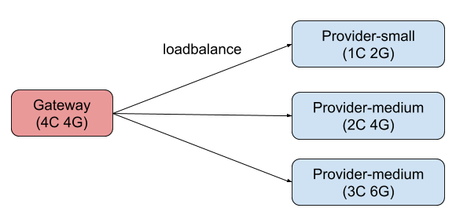

# 阿里巴巴2019中间件性能挑战赛-自适应负载均衡（初赛）赛题

## 注意事项

> 一定要看

**不要** 在项目里添加**logback.xml** 。检测程序是基于日志分析是否作弊的，如果servcie-consumer.log 找不到，成绩会被判定为**无效**。

## 更新日志
- 2019-06-27 更新 [internal-service](https://code.aliyun.com/middlewarerace2019/internal-service) ,修改 provider-conf.json 配置。对应的[docker](https://code.aliyun.com/middlewarerace2019/docker) 项目也已经更新，选手需要重新执行`build.sh`构建项目。
- 2019-06-18 更新 [internal-service](https://code.aliyun.com/middlewarerace2019/internal-service) ,增加 provider 配置变更次数和增大随机性。对应的[docker](https://code.aliyun.com/middlewarerace2019/docker) 项目也已经更新，选手需要重新执行`build.sh`构建项目。

## 背景

### 负载均衡 (loadbalance)
[负载均衡](https://en.wikipedia.org/wiki/Load_balancing_(computing))是大规模计算机系统中的一个基础问题。灵活的负载均衡算法可以将请求合理地分配到负载较少的服务器上。理想状态下，负载均衡算法应该能够最小化服务响应时间(RTT)，使系统吞吐量最高，从而保持高性能服务能力。自适应负载均衡是指负载均衡算法能够根据服务能力动态的进行流量调度，无论当系统处在空闲、稳定还是繁忙状态，系统都可以保持较好的性能，不会产生饥饿或者宕机。

### Apache Dubbo (incubating)
[Apache Dubbo (incubating)](http://dubbo.apache.org/zh-cn/) |ˈdʌbəʊ| 是一款高性能、轻量级的开源Java RPC框架，它提供了三大核心能力：面向接口的远程方法调用，智能容错和负载均衡，以及服务自动注册和发现。


### 题目由来

传统的负载均衡场景为单调度器模式，即中心化负载均衡：调度器负责将新到的请求立即转发至多个后端服务器中的一个。随着分布式系统的发展，这种单调度器模式在扩展性、可靠性和性能方面的问题愈发严重。因此，设计和实现去中心化且性能优异的负载均衡是学术和工业界的共同需求。


## 赛题说明

基于题目提供的 Dubbo LoadBalance 接口，实现一套自适应负载均衡机制，作为扩展作用于 gateway 和 provider两端。要求能够具备以下能力：

1. Gateway(Consumer) 端能够自动根据服务处理能力变化动态最优化分配请求保证较低响应时间，较高吞吐量。
2. Provider 端能自动进行服务容量评估，当请求数量超过服务能力时，允许拒绝部分请求，以保证服务不过载。
3. 当请求速率高于所有的 Provider 服务效率之和时，允许 Gateway( Consumer ) 拒绝服务新到请求。

### 架构



- 所有程序均在不同的 docker 容器中运行,每个容器都独占运行在不同的物理机上：
- Gateway 负责将请求转发至 Provider；
- Provider 处理请求返回响应；
- Provider 按照 CPU 核数和内存大小分为 Small、Medium、Large 三个规格；
- 选手需要设计实现 Gateway 选择 Provider 的 load balance 算法。

### 目标

1. 保证系统稳定性，任何情况下服务都不能被打挂；
2. 保证请求成功率，尽可能的让更多的请求在较短的时间内被处理；
3. 尽可能避免因重试导致流量被过度放大。
4. 为降低难度，本次比赛题目只使用了一个 Consumer。但负载均衡算法应该是可扩展的，需要考虑多 Consumer 和多 Provider 的情况。

### 服务

Provider 是服务提供者，Gateway( Consumer ) 是服务消费者，Gateway 消费 Provider 提供的服务。Gateway 及 Provider 服务的实现 **由赛会官方提供**。 为简化流程，本次比赛不使用服务注册和发现机制，Gateway 通过 docker 的 dns 直连调用 Provider 服务。

Provider 服务接口：
```java
public interface HashInterface {

  /**
   * 计算给定字符串的 hash 值
   * <li>
   *     <ol>接口的响应时间符合负指数分布 </ol>
   *     <ol>接口的并发度（允许同时调用的线程数）会随时间增加或减小，从而模拟生产环境可能的排队</ol>
   * </li>
   * @param input 要计算的字符串
   * @return 字符串的 hash 值
   */
  int hash(String input);
}
```
Consumer 在接收到客户端请求以后，会生成一个随机字符串，然后根据负载均衡算法选择一个 Provider 。 由 Provider 计算哈希值后返回，客户端会校验该哈希值与其生成的数据是否相同，如果相同则返回正常（200），否则返回异常（500）。

### 启动和调用流程

1. 启动三个 Provider 实例
2. 启动 Gateway 实例
3. 客户端通过 HTTP 访问 Gateway 服务
4. Gateway 按照选手扩展的路由或负载均衡算法选择一个 Provider 并进行调用
5. Provider 处理请求，返回结果
6. Gateway 将本次请求的结果返回至客户端(success/failure)

### 项目结构

- internal-dubbo dubbo 依赖，不允许修改，评测时不依赖选手编译的 jar 包；
  - 此次比赛的 Dubbo 版本是私有版本，具备开源 Dubbo 没有的一些扩展接口，选手需要下载源码，本地构建，不应该依赖远程仓库拉取依赖
- internal-service 服务的接口定义和实现，不允许修改，评测时不依赖选手编译的 jar 包；
  - 包含了服务端和客户端，服务端包含了负载动态变化的逻辑，开放给选手自己本地测试，禁止选手设计一个负载均衡算法来 hack 变化的过程；选手可以本地启动服务端客户端示例进行本地测试
- adaptive-loadbalance(workspace) 选手进行开发的模块, 评测时会以 jar 包依赖的方式加载。
  - 在选手本地开发阶段时，可以直接在 internal-service 的相应模块声明该 maven 依赖

### 开发接口

### com.aliware.tianchi.UserLoadBalance

**负载均衡接口**，用户需要更改该接口的实现，在示例代码中，实现了一个随机负载均衡算法

```java
public class UserLoadBalance implements LoadBalance {

    @Override
    public <T> Invoker<T> select(List<Invoker<T>> invokers, URL url, Invocation invocation) throws RpcException {
        return invokers.get(ThreadLocalRandom.current().nextInt(invokers.size()));
    }
}
```

### 辅助接口

### org.apache.dubbo.rpc.listener.CallbackListener

```java
@SPI
public interface CallbackListener {
    void receiveServerMsg(String msg);
}
```

客户端扩展接口，用于接收服务端的推送。

**接口实现示例**

```java
public class CallbackListenerImpl implements CallbackListener {
    @Override
    public void receiveServerMsg(String msg) {
        System.out.println("receive msg from server :" + msg);
    }
}
```

**添加 SPI 声明文件**

resources/META-INF/services/org.apache.dubbo.rpc.listener.CallbackListener

```
com.aliware.tianchi.CallbackListenerImpl
```

### org.apache.dubbo.rpc.service.CallbackService

```java
@SPI
public interface CallbackService {
    void addListener(String key, CallbackListener listener);
}
```

服务端扩展接口，用于接收客户端 CallbackListener 的注册，并执行推送能力。

**接口实现示例**

```java
public class CallbackServiceImpl implements CallbackService {

    public CallbackServiceImpl() {
        timer.schedule(new TimerTask() {
            @Override
            public void run() {
                if (!listeners.isEmpty()) {
                    for (Map.Entry<String, CallbackListener> entry : listeners.entrySet()) {
                        try {
                            entry.getValue().receiveServerMsg(new Date().toString());
                        } catch (Throwable t1) {
                            listeners.remove(entry.getKey());
                        }
                    }
                }
            }
        }, 0, 5000);
    }

    private Timer timer = new Timer();

    /**
     * key: listener type
     * value: callback listener
     */
    private final Map<String, CallbackListener> listeners = new ConcurrentHashMap<>();

    @Override
    public void addListener(String key, CallbackListener listener) {
        listeners.put(key, listener);
        listener.receiveServerMsg(new Date().toString()); // send notification for change
    }
}
```

由于客户端可以实现多个 CallbackListener 实例，故在示例中使用 `Map<String, CallbackListener>` 维护关联。

**添加 SPI 声明文件**

resources/META-INF/services/org.apache.dubbo.rpc.service.CallbackService

```
com.aliware.tianchi.CallbackServiceImpl
```

> 以上 CallbackListener 和 CallbackService 结合使用，实现了一个服务提供者每 5 秒向客户端推送服务器时间的能力，选手可以自行扩展。

### org.apache.dubbo.remoting.transport.RequestLimiter

```java
@SPI
public interface RequestLimiter {
    boolean tryAcquire(Request request, int activeTaskCount);
}
```

限流扩展接口，服务端扩展接口

**接口实现示例**

```java
public class TestRequestLimiter implements RequestLimiter {

    @Override
    public boolean tryAcquire(Request request, int activeTaskCount) {
        return true;
    }

}
```

请求参数说明：
- request 服务请求详细信息
- activeTaskCount 服务端对应线程池的活跃线程数

返回值说明：
- false 不提交给服务端业务线程池直接返回，客户端可以在 Filter 中捕获 RpcException
- true 不限流

**添加 SPI 声明文件**

resources/META-INF/services/org.apache.dubbo.remoting.transport.RequestLimiter

```
com.aliware.tianchi.TestRequestLimiter
```

> 限流接口开放给选手，旨在让选手保护服务端不被击垮，非强制使用

### org.apache.dubbo.rpc.Filter


```java
@SPI
public interface Filter {

    Result invoke(Invoker<?> invoker, Invocation invocation) throws RpcException;

    default Result onResponse(Result result, Invoker<?> invoker, Invocation invocation) {
        return result;
    }

}
```

**接口实现示例**

客户端过滤器

```java
@Activate(group = Constants.CONSUMER)
public class TestClientFilter implements Filter {
    @Override
    public Result invoke(Invoker<?> invoker, Invocation invocation) throws RpcException {
        try{
            Result result = invoker.invoke(invocation);
            return result;
        }catch (Exception e){
            // do sth
            throw e;
        }

    }
}
```

服务端过滤器

```java
@Activate(group = Constants.PROVIDER)
public class TestServerFilter implements Filter {
    @Override
    public Result invoke(Invoker<?> invoker, Invocation invocation) throws RpcException {
        try{
            Result result = invoker.invoke(invocation);
            return result;
        }catch (Exception e){
            // do sth
            throw e;
        }

    }
}
```

**添加 SPI 声明文件**

resources/META-INF/services/org.apache.dubbo.rpc.Filter

```
com.aliware.tianchi.TestClientFilter
com.aliware.tianchi.TestServerFilter
```

> 选手无法更改服务消费者和服务提供者的逻辑，但可以借助 Filter 进行 AOP 控制。禁止在服务端获取 salt 值提前返回，需要保证请求到达真实服务。

### 接口说明

- 开发接口固定为 `UserLoadBalance`，选手可以修改其实现，但不能重命名、移动其位置，包括其 SPI 定义文件，否则评测程序无法正常加载选手的代码
- 辅助接口不强制选手使用，只是为了方便一部分负载均衡算法的实现而设计的，一些算法客户端需要依赖服务端的信息做决策
- Dubbo 拥有众多的扩展点，选手可以在不影响赛题题意的前提下适当使用，详情参考 Dubbo 官方文档：用户文档 -> 开发者指南 -> [SPI 扩展实现](http://dubbo.incubator.apache.org/zh-cn/docs/dev/impls/protocol.html)

### 要求和限制

0. 题目语言限定为 Java ；
1. 不允许修改 Dubbo/Gateway 相关配置；
2. 不允许使用脚本或者其他方式替换 provider/gateway 服务；
3. 不允许使用 Provider 服务内的相关信息，如配置的 averageRTT/ maxConcurrency 等, 允许自行统计和计算；
4. 不允许引入外部依赖，如果对开源代码有所借鉴，可小部分 copy；
5. 需要提供通用的算法实现，不允许以 hardcode 流量比例的方式来分配流量；
6. Gateway 和 Provider 的 JVM 参数和其他参数不允许修改。
7. 不允许使用任何 hack 的方式作弊，每次提交评测的代码都会存档，作弊会被取消参赛资格。

### 快速搭建开发环境

#### 依赖项目

- [internal-dubbo](https://code.aliyun.com/middlewarerace2019/dubbo-internal)

    比赛使用的特定版本 dubbo, 需要手动安装依赖。
    ```bash
    git clone https://code.aliyun.com/middlewarerace2019/dubbo-internal.git
    cd dubbo-internal
    mvn clean install -Dmaven.test.skip=true
    ```
   
- [internal-service](https://code.aliyun.com/middlewarerace2019/internal-service)

    内置服务，负责加载选手实现的负载均衡算法，启动 Consumer 和 Provider 程序。已经由赛题官方提供，开发过程不需要修改，只需要安装依赖。
    ```bash
    git clone https://code.aliyun.com/middlewarerace2019/internal-service.git
    cd internal-service
    mvn clean install -Dmaven.test.skip=true
    ```

#### 开发项目

- [adaptive-loadbalance](https://code.aliyun.com/middlewarerace2019/adaptive-loadbalance)

    选手按照题目提供的接口，实现 provider-consumer 协同的自适应负载均衡策略。

#### 本地开发

- fork 本项目, clone 自己的仓库到本地

- 配置 hosts，指向本地 IP ,或者将 internal-service 项目中的 `com.aliware.tianchi.netty.HttpProcessHandler#buildUrls` 相关地址修改为本地 IP,也可以在 `buildUrls` 中添加多个不同的 Provider 地址。
  ```
  ${宿主机IP地址} provider-small
  ${宿主机IP地址} provider-medium
  ${宿主机IP地址} provider-large
  ```
- 构建 `dubbo-internal` 项目，命令在上节已给出。
- 构建 demo 的 workspace 项目（即本项目）
- 运行 `internal-service` 项目中的 `com.aliware.tianchi.MyProvider` 启动 Provider，为了模拟负载均衡场景，需要启动三个 Provider，分别指定启动参数 `-Dquota=large`、`-Dquota=medium`、`-Dquota=small`
- 运行 `internal-service` 项目中的 `com.aliware.tianchi.MyConsumer` 启动 Consumer
- 打开浏览器 [http://localhost:8087/call](http://localhost:8087/call)，显示`OK`即表示配置成功。

#### 本地压测

在 `internal-service` 项目中存放了一个 wrk.lua 脚本，选手可以在该项目根目录下执行

```
wrk -t4 -c1024 -d90s -T5 --script=./wrk.lua --latency http://localhost:8087/invoke
```

进行压测，压测前请确认本机已安装压测工具 wrk

## 评测

提交评测前，选手需要添加`middleware2019`为要评测的代码仓库 reporter ，否则无法进行评测。

添加成员地址：https://code.aliyun.com/{你的账号名称}/adaptive-loadbalance/project_members

评测地址  https://tianchi.aliyun.com/competition/entrance/231714/submission

提交请使用 git@开头的 ssh 仓库地址

### 环境


所有程序均执行在单独的物理机中，每个程序都有 CPU 和内存的限制。评测环境只需要提交代码地址，如果需要模拟测试环境，请参考[docker](https://code.aliyun.com/middlewarerace2019/docker/tree/master)和 [benchmarker](https://code.aliyun.com/middlewarerace2019/benchmarker)

构建环境失败可先查阅 [FAQ](https://code.aliyun.com/middlewarerace2019/adaptive-loadbalance/blob/master/FAQ.md) 查找解决方案

- Consumer ： 1 台 4c4g
- Provider ： 3台
  - Provider-small: 1c2g 运行端口 20880
  - Provider-medium: 2c4g 运行端口 20870
  - Provider-large: 3c6g 运行端口 20890
- 每个 Provider 的服务能力(处理请求的速率)都会不定期变化：
  - 三个 Provider 的总处理能力会分别在小于/约等于/大于请求量三个状态变动；
  - 任意一个 Provider 的单机处理能力都小于总请求量。
  

#### 环境和启动参数

- JDK 版本： Openjdk 1.8.0_212
- GC collector : Parallel Scavenge + Parallel Old
- 宿主机 OS:  4.19.34-11.al7.x86_64
- Docker 版本: 1.13.1

| 程序 | 宿主机配置 | JVM参数 | Docker资源限制参数 |
| :--: | :--------: | :------: |  :------: |
|  consumer         | Intel Xeon(Skylake) Platinum 8163, 2.5 GHz,1.5 Gbps, 500k PPS | -Xms4G  -Xmx4G  |  -m 4g   |
|  provider-small   | Intel Xeon(Skylake) Platinum 8163, 2.5 GHz,1.0 Gbps, 300k PPS | -Xms1G  -Xmx1G  |  --cpuset-cpus="0" -m 2g      |
|  provider-medium  | Intel Xeon(Skylake) Platinum 8163, 2.5 GHz,1.5 Gbps, 500k PPS | -Xms2G  -Xmx2G  |  --cpuset-cpus="0,1" -m 4g    |
|  provider-large   | Intel Xeon(Skylake) Platinum 8163, 2.5 GHz,1.5 Gbps, 500k PPS | -Xms3G  -Xmx3G  |  --cpuset-cpus="0,1,2" -m 6g  |

### 评测流程

流程分为预热和正式评测两部分，预热部分不计算成绩，正式评测部分计算成绩。

#### 预热

1. 启动 Gateway 和 Provider；
2. PTS 按固定请求速率向 Gateway 发请求，持续 30 秒。
3. 预热结束，进行正式评测。

#### 正式评测

1. PTS 以固定连接数(1024)向 Gateway 发送请求；
2. Provider 的服务能力会按照一定规则变动；
3. 1分钟后，PTS 停止发请求，压测结束。

### 排名规则

1. 按照 PTS 统计的成功请求数和最大 TPS 作为排名依据；
2. 成功请求数越大，排名越靠前；
3. 成功数相同的情况下，按照最大 TPS 排名。

样例：

| 排名 | 成功请求数 | 最大 TPS |
| :--: | :--------: | :------: |
|  1   | 1,000,000  |  9,999   |
|  2   | 1,000,000  |  9,998   |
|  3   |  800,000   |  10,000  |

