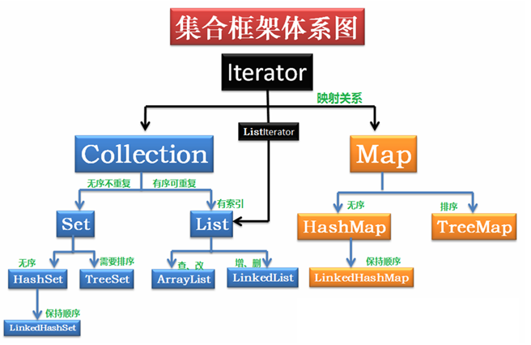

# 2.J2SE：J2SE轻松入门第二季  

## 1.枚举&静态  
1. 枚举：枚举的定义，用enum Gender{ Male,Fenale },后面用Gender就可以点出来
2. 静态成员：表示该成员属于所有的类，到处都能访问（访问静态成员，必须使用静态方法）  
  ``被static修饰后的成员，在编译时由内存分配一块内存空间，直到程序停止运行才会释放，那么就是说该类的所有对象都会共享这块内存空间``  

---

## 2.异常  
异常是一个类的对象，所有的异常父类都为Throwable  
Throwable主要有两个子类：Error&Exception  
1. Error:JVM（虚拟机）运行异常，无法处理  
2. Exception：之一RuntimeException，表示运行时异常，可以try catch。而非RunTimeException必须得处理。添加finally表示最后一定会执行的代码块。  

>**RuntimeException**  
>1.NullPointerException（空指针异常）  
>2.IndexOutOfBoundsException（数组下标越界异常） ArrayIndexOutOfBoundsException  
>3.NumberFormatException（数据格式异常）  
>4.ClassCastException（类型转换异常）  
>5.IllegalArgumentException（非法参数异常）  
>6.ArithmeticException（算术异常）  
>7.IllegalStateException（非法语句异常）   
>
>**非RuntimeException**  
>ClassNotFoundException（类找不到异常）  

异常也可以使用throws抛出的方式，谁调用谁处理  

---

## 3.反射  
动态加载类 ``Class<?> c=Class.forName("javastudy.Person");``  
创建对象 ``Person zhang=(Person)c.newInstance();``   
获取构造函数数组 ``Constructor<?> cons=c.getConstructors();``  
获取该类的接口组 ``Class<?>[] inter=c.getInterfaces();``  
通过反射获取对象 ``Person wang=(Person)cons[1].newInstance("Mary",30);``  
**利用反射，动态加载Person类。获取该类的构造函数数组，使用构造函数构造对象。获取该类的接口数组，列出所有的接口名**  
```java
public interface Animal {

}

public class Person implements Animal{   //实现animal接口
	int age;
	String name;
	//重写构造方法
	public Person() {
		// TODO Auto-generated constructor stub
	}
	//重载构造方法
	public Person(int age,String name){
		this.name=name;
		this.age=age;
	}
}

public class Main {
public static void main(String[] args) throws ClassNotFoundException, InstantiationException, IllegalAccessException, IllegalArgumentException, InvocationTargetException {
	//动态加载类
	Class<?> c=Class.forName("javastudy.Person");
	//用newInstance方法创建对象
	Person zhang=(Person) c.newInstance();
	//获取构造函数数组
	Constructor<?>[] cons=c.getConstructors();
	//获取接口数组
	Class<?>[] inter=c.getInterfaces();
	//使用获取来的构造函数
	Person wang=(Person) cons[1].newInstance(30,"Mary");

}
```

---

## 4.集合框架  
### 1.Collection介绍  
1. 数组：定长，只能存同一种类型  
2. ArrayList:基于数组，查找速度比较快  
  遍历器循环：  
```
Iterator<String> it=al.iterator();
while(it.hasNext()){
	syso(it.next());	
}
```
3. LinkList:基于链表，修改数据比较快  
4. HashSet:Set没有索引，**不可以重复**，Hash是无序的  
5. TreeSet:没有索引，并且是无序的  
    
  List和Set都属于接口，其下结点为它们的实现类  

### 2.定义比较器  
1. 比较类实现Comparator<Person>接口  
2. 实例化ComparaTo方法，用传进来的Person类比较  
  返回1,0，-1三个值（或者直接返回compareTo方法）  
3. 调用的时候，传方法  
  ``TreeSet<Dog> ts=new TreeSet<Dog>(new MyCom());   //传比较器对象``  
  **定义一个类，实例化类之后存进TreeSet中，其输出通过类的age排序**  
```java
public class Main {
	public static void main(String[] args) {
		TreeSet<Person> ts=new TreeSet<Person>(new MyCom());
		ts.add(new Person(1, "xiaoming"));
		ts.add(new Person(2, "xiaobai"));
		ts.add(new Person(3, "xiaohei"));
		ts.add(new Person(6, "xiaohong"));
		ts.add(new Person(5, "xiaohuang"));
		Iterator<Person> it=ts.iterator();
		while(it.hasNext()){
			System.out.println(it.next().name);
		}
	}
}

class Person{
	int age;
	String name;
	public Person(int age,String name) {
		this.name=name;
		this.age=age;
	}
}

class MyCom implements Comparator<Person>{
	public int compare(Person o1, Person o2) {
		if(o1.age>o2.age){
			return 1;
		}else if(o1.age==o2.age){
			return 0;
		}else{
			return -1;
		}
	}
}
```

---

### 3.Map介绍（HashMap&TreeMap）  
1. 获取键的集合：使用keySet()方法，Set集合用Iterator遍历  
2. 通过序号获取内容：cities.get(序号);  
3. 拿整个键值对：``Set<Entry<String,String>> entries=cities.entrySet();``,拿到Entry之后可以通过getKey()获取键，用getValue()获取值。  

---

**进入下一章：[3.J2SE：J2SE轻松入门第三季](J2SE_3.md)**