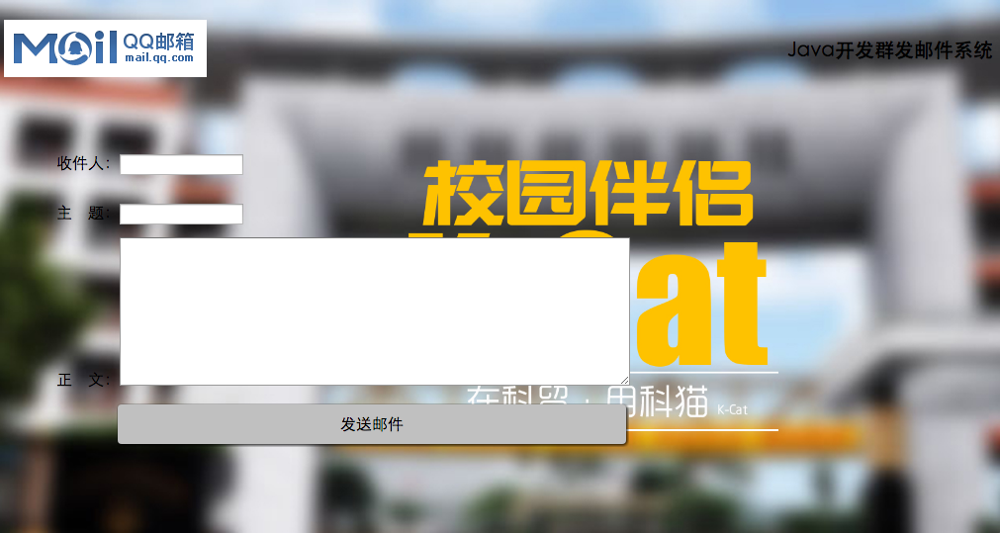

# 1.Java开发邮件群发系统      

### 1.前端设计  

首先制作前端页面，通过表格的方式将标题，发送对象，内容传到servlet

### 2.后台设计  

通过web.xml配置servlet  

```xml
<?xml version="1.0" encoding="UTF-8"?>
<web-app xmlns:xsi="http://www.w3.org/2001/XMLSchema-instance" xmlns="http://java.sun.com/xml/ns/javaee" xmlns:web="http://java.sun.com/xml/ns/javaee/web-app_2_5.xsd" xsi:schemaLocation="http://java.sun.com/xml/ns/javaee http://java.sun.com/xml/ns/javaee/web-app_2_5.xsd" id="WebApp_ID" version="2.5">
  <display-name>email-yubin</display-name>
  
  <servlet>
  	<servlet-name>Mail</servlet-name>
  	<servlet-class>com.kcat.util.Mail</servlet-class>
  </servlet>
  <servlet-mapping>
  	<servlet-name>Mail</servlet-name>
  	<url-pattern>/Mail</url-pattern>
  </servlet-mapping>
  
  <welcome-file-list>
    <welcome-file>index.html</welcome-file>
    <welcome-file>index.htm</welcome-file>
    <welcome-file>index.jsp</welcome-file>
    <welcome-file>default.html</welcome-file>
    <welcome-file>default.htm</welcome-file>
    <welcome-file>default.jsp</welcome-file>
  </welcome-file-list>
</web-app>
```

导入javamail的jar包，调用其api，需要读取邮箱配置，目前还未解决（报错中）  

案例截图：  



[案例源码（缺陷版）](../SourceCode/Email_Mass/)    