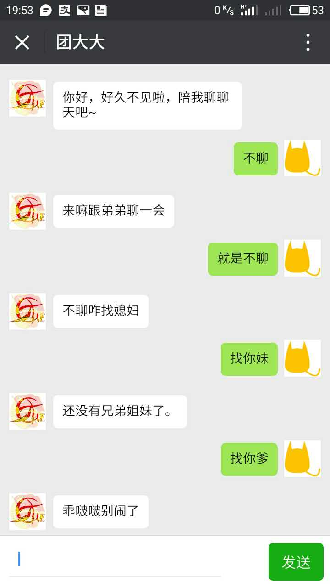
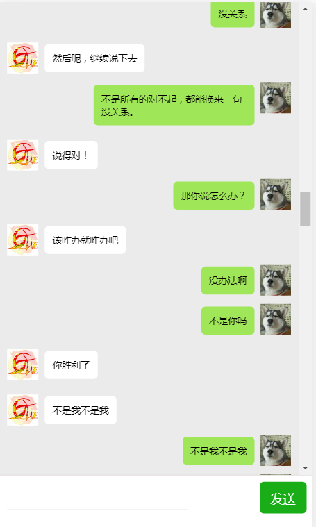
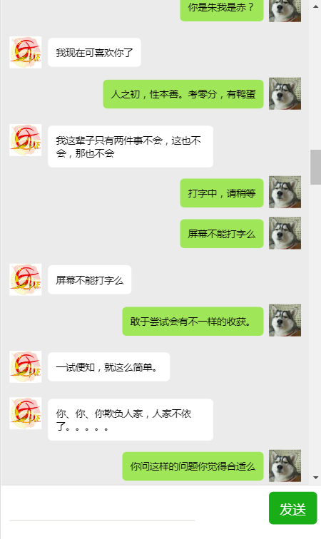

# 智能聊天机器人（手机版）  

### 1.前端部分  

```html
<html>
<head>
<meta http-equiv="Content-Type" content="text/html; charset=UTF-8">
<meta name="viewport" content="width=device-width" />  
<style>
	*{
		margin: 0;
		padding: 0;   /*解决兼容性*/
	}
	body{
		background-color:#EBEBEB;
		font-size: 12px;
	}
	.b_body{
		overflow: auto;   /*添加滚动条*/
		width:100%;
		height: 90vh;
	}
	.rotWord{overflow:hidden;margin-top: 3px;}
	.rotWord span{
		width:40px; height:40px; background:url(img/rot.jpg);background-size:40px 40px; float:left; margin-top: 15px;  margin-right: 2px;
	    margin-left: 10px;
	}
	.rotWord p{
		float:left; padding:10px; background:white; margin-left:6px; border-radius:5px; word-break:break-all; max-width:186px; 
	    margin-top: 17px;
	}
	
	.myWord{overflow:hidden;margin-top: 3px;}
	.myWord span{
		width:40px; height:40px; background:url(img/my.jpg);background-size:40px 40px;  float:right; margin-top: 8px; 
	margin-right: 10px;
	}
	.myWord p{
		float:right; padding:10px; background:#9FE658; margin-right:7px; border-radius:5px; word-break:break-all; max-width:186px; 
		margin-top: 11px;
	}
	.b_footer{
		width:100%;
		height:10vh;
		background-color: white;
		float:left;
	    border-top: 1px solid #e4dede;
	}
	#input{
	    width: 231px;
	    height: 38px;
	    background: white;
	    text-indent: 10px;
	    float: left;
	    outline: none;
	    overflow: hidden;
	    margin-left: 10px;
	    margin-top: 6px;
	    border: none;
	    border-bottom: #e8e7e4 1px solid;
	}
	#btn{
	    width: 60px;
	    height: 41px;
	    background: #19AD17;
	    user-select: none;
	    text-align: center;
	    line-height: 43px;
	    font-size: 16px;
	    color: white;
	    margin-top: 8px;
	    margin-right: 7px;
	    float: right;
	    cursor: pointer;
	    border-radius: 5px;
	}
	
</style>

<title>团大大</title>
</head>
<body>
	<div class="b_body">
		<div class="rotWord">
			<span></span>
			<p>你好，好久不见啦，陪我聊聊天吧~</p>
		</div>
	</div>
	<div class="b_footer">
		<input id="input" type="text" autocoplete="off" />
		<div id="btn" onclick="query()">发送</div>
	</div>
	<script type="text/javascript" src="js/jquery-3.1.1.min.js"></script>
	<script type="text/javascript">
		var text=$("#input");
		function query(){
			if(text.val()==""||text.val==""){
				text.focus();
				return;
			}
			$(".b_body").append("<div class='myWord'><span></span><p>"+text.val()+"</p></div>");
			$(".b_body").scrollTop(10000000);
			$.ajax({
				type:"post",
				url:"robot",
				data:{"text":text.val()},
				success:function(data){
					var result=$.parseJSON(data).text;
					$(".b_body").append("<div class='rotWord'><span></span><p>"+result+"</p></div>");
					$(".b_body").scrollTop(10000000);
				}
			});
			text.val("");
			text.focus();
		}
		$(document).keydown(function(event){
			if(event.keyCode==13){
				query();
			}
		});
		
	</script>
	
</body>
</html>
```

这里前端主要是处理文字怎么传到另一个p标签上，并且还得控制标签自动换行，输入框清空，界面我是模仿微信聊天窗口做的    

### 2.后台部分  

```java

/**
 * 聊天信息处理类
 * @author liyb
 *
 */

@WebServlet("/robot")
public class RobotAction extends HttpServlet{
	public static final String APIKEY="857532846c5349939e6a0c70be75b6b3";
	public static final String url="http://www.tuling123.com/openapi/api?key=";
	
	@Override
	protected void doGet(HttpServletRequest req, HttpServletResponse resp) throws ServletException, IOException {
		doPost(req, resp);
	}

	@Override
	protected void doPost(HttpServletRequest req, HttpServletResponse resp) throws ServletException, IOException {
		req.setCharacterEncoding("utf-8");
		resp.setCharacterEncoding("utf-8");
		
		String text=req.getParameter("text");
		String result=getResult(text);
		resp.getWriter().print(result);
	}
	
	public static String getResult(String text){
		String INFO="";
		StringBuilder sb=new StringBuilder();
		
		try {
			INFO=URLEncoder.encode(text,"UTF-8");
			String getUrl=url+APIKEY+"&info="+INFO;
			URL queryUrl=new URL(getUrl);
			URLConnection connection=queryUrl.openConnection();
			BufferedReader br=new BufferedReader(new InputStreamReader(connection.getInputStream(),"UTF-8"));
			String temp="";
			while((temp=br.readLine())!=null){
				sb.append(temp);
			}
		} catch (Exception e) {
		}
		return sb.toString();
	}
}
```

1. INFO=URLEncoder.encode(text,"UTF-8");设置传输的编码
2. 执行链接，获取信息存入InputStream中，存入的时候也需要设置编码   

``URLConnection connection=queryUrl.openConnection();``  

``BufferedReader br=new BufferedReader(new InputStreamReader(connection.getInputStream(),"UTF-8"));``  

3. 用BufferedReader包装InputStream，然后用readLine读取信息，用append追加后传到前台  
4. 上面的apiKEY是我申请的，需要的可以去网上注册一个


案例截图：  

  

[案例源码](../SourceCode/RobotChat/)        

### 3.修改版  

这里在前端做了一点修改，做成两个机器人聊天的效果，由于调用的是同一个api，所以传输信息有时候会重复  

```html
<html>
<head>
<meta http-equiv="Content-Type" content="text/html; charset=UTF-8">
<meta name="viewport" content="width=device-width" />  
<style>
	*{
		margin: 0;
		padding: 0;   /*解决兼容性*/
	}
	body{
		background-color:#EBEBEB;
		font-size: 12px;
	}
	.b_body{
		overflow: auto;   /*添加滚动条*/
		width:100%;
		height: 90vh;
	}
	.rotWord{overflow:hidden;margin-top: 3px;}
	.rotWord span{
		width:40px; height:40px; background:url(img/rot.jpg);background-size:40px 40px; float:left; margin-top: 15px;  margin-right: 2px;
	    margin-left: 10px;
	}
	.rotWord p{
		float:left; padding:10px; background:white; margin-left:6px; border-radius:5px; word-break:break-all; max-width:186px; 
	    margin-top: 17px;
	}
	
	.myWord{overflow:hidden;margin-top: 3px;}
	.myWord span{
		width:40px; height:40px; background:url(img/my.jpg);background-size:40px 40px;  float:right; margin-top: 8px; 
	margin-right: 10px;
	}
	.myWord p{
		float:right; padding:10px; background:#9FE658; margin-right:7px; border-radius:5px; word-break:break-all; max-width:186px; 
		margin-top: 11px;
	}
	.b_footer{
		width:100%;
		height:10vh;
		background-color: white;
		float:left;
	    border-top: 1px solid #e4dede;
	}
	#input{
	    width: 231px;
	    height: 38px;
	    background: white;
	    text-indent: 10px;
	    float: left;
	    outline: none;
	    overflow: hidden;
	    margin-left: 10px;
	    margin-top: 6px;
	    border: none;
	    border-bottom: #e8e7e4 1px solid;
	}
	#btn{
	    width: 60px;
	    height: 41px;
	    background: #19AD17;
	    user-select: none;
	    text-align: center;
	    line-height: 43px;
	    font-size: 16px;
	    color: white;
	    margin-top: 8px;
	    margin-right: 7px;
	    float: right;
	    cursor: pointer;
	    border-radius: 5px;
	}
	
</style>

<title>团大大</title>
</head>
<body>
	<div class="b_body">
		<div class="rotWord">
			<span></span>
			<p>你好，好久不见啦，陪我聊聊天吧~</p>
		</div>
	</div>
	<div class="b_footer">
		<input id="input" type="text" autocoplete="off" />
		<div id="btn" onclick="query()">发送</div>
	</div>
	
	<script type="text/javascript" src="js/jquery-3.1.1.min.js"></script>
	<script type="text/javascript">
		var result="";
		var text=$("#input");
		function query(){
			if(text.val()==""||text.val==""){
				text.focus();
				return;
			}
			$(".b_body").append("<div class='myWord'><span></span><p>"+text.val()+"</p></div>");
			$(".b_body").scrollTop(10000000);
			$.ajax({
				type:"post",
				url:"robot",
				data:{"text":text.val()},
				success:function(data){
					result=$.parseJSON(data).text;
					$(".b_body").append("<div class='rotWord'><span></span><p>"+result+"</p></div>");
					$(".b_body").scrollTop(10000000);
					
				}
			});
			text.val("");
			text.focus();
			other();
		}
		function other(){
			$.ajax({
				type:"post",
				url:"robot",
				data:{"text":result},
				success:function(data){
					result=$.parseJSON(data).text;
					text.val(result);
					$(".b_body").scrollTop(10000000);
					query();
				}
			});
		}
		
		$(document).keydown(function(event){
			if(event.keyCode==13){
				query();
			}
		});
		
	</script>
	
</body>
</html>
```

效果：

  

  