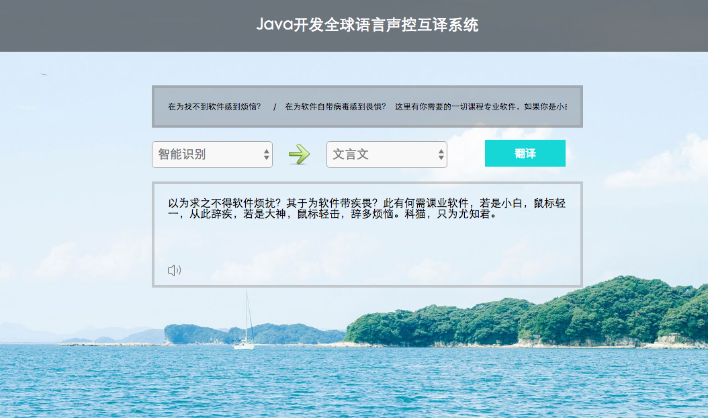

# 1.Java开发全球语言声控互译系统    

### 1.api的使用  

这里用到了百度的api，导入jar包，使用build path加载jar包   

使用api，需要传入id和key    

调用getTransResult方法就可以对传入的参数处理  

（添加注解@Test再按f11可以进行单元测试）

注解成servlet，用doPost进行调用，返回翻译信息到前台  

```java
@WebServlet(name="query",urlPatterns="/query")  //声明servlet
public class Query extends HttpServlet{
	private static final String APPID="20170718000065115";
	private static final String SECURITY_KEY="yhnIbeIxB81zJx8mj2e0";
	

	@Override
	protected void doPost(HttpServletRequest request, HttpServletResponse response) throws ServletException, IOException {
		// TODO Auto-generated method stub
		request.setCharacterEncoding("utf-8");
		response.setCharacterEncoding("utf-8");
		String text=request.getParameter("text");
		String from=request.getParameter("from");
		String to=request.getParameter("to");
		response.getWriter().print(getResult(text, from, to));
	}

	/**
	 * 获取翻译结果的方法
	 * @return
	 */
	public static String getResult(String text,String from,String to) {
		TransApi api=new TransApi(APPID,SECURITY_KEY);   //使用翻译Api
		return api.getTransResult(text, from, to);   //获取参数结果
	}
	
	@Test
	public void test() {   //测试
		System.out.println(getResult("冬天", "zh", "en"));
	}
}
```

### 2.ajax传数据  

使用ajax将数据传到servlet，获取返回的信息，转化为json显示  

```javascript
<script type="text/javascript">
function query(){   /* 定义查询方法 */
	 var text=$("#sysin").val();
	 var from=$("#from").val();
	 var to=$("#to").val();
	 $.ajax({
		 type:"post",    //请求方式
		 url:"query",    //请求地址
		 data:{"text":text,"from":from,"to":to},
		 success:function(data){
			 var StringJson=$.parseJSON(data);   //转化为json
			 var trans_result=StringJson.trans_result[0].dst;
			 $("#r_text").html(trans_result);
			 
			 function audioplay(){
				 var str=trans_result.replace(/\s+/g,"_");
				 if(to=="wyw"){   //解决中文类的其他读音
					 to="zh";
				 }else if(to=="yue"){
					 to="cte";
				 }
				 //语音调用网上的
				var obj=$('<audio src=http://fanyi.baidu.com/gettts?lan='+to+'&text='+str+'&spd=3&source=web autoplay></audio>');
			 	$("audio").remove();
				$("body").append(obj);
			 }
			 $(".audio").click(function(){
				 audioplay();
			 });
		 }
	 });
}

</script>
```

案例截图：  

  [案例源码](../SourceCode/trans_pro/)    


