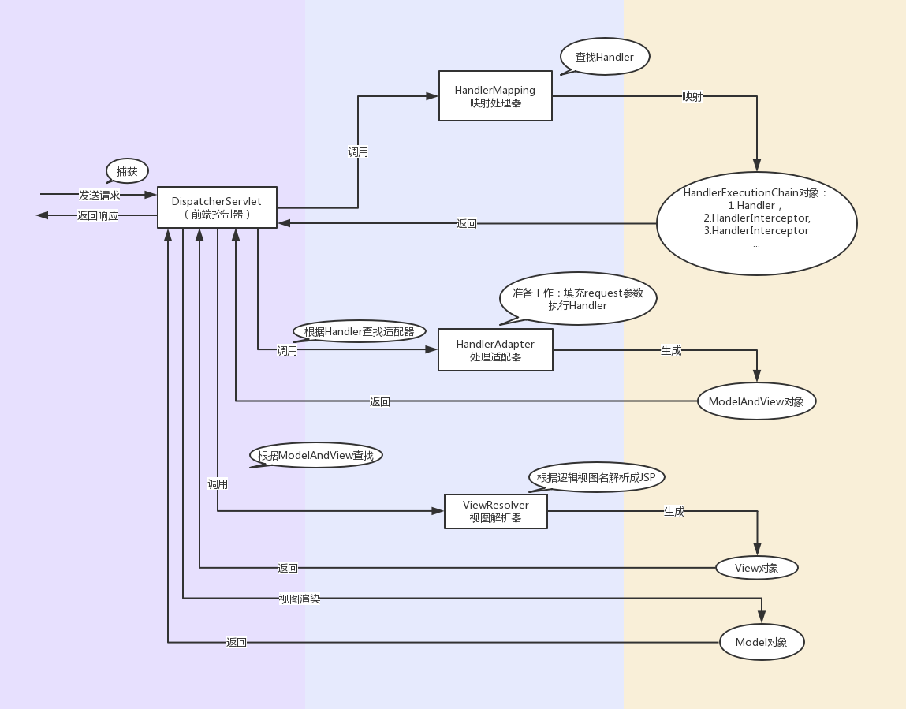

# SpringMVC

SpringMVC属于Spring基本架构中的一个组成部分。

     

SpringMVC接收浏览器的请求响应，对数据进行处理，然后返回页面进行显示。  

## 搭建springMVC项目  

### 1.创建web项目  

首先使用maven的maven-archetype-webapp(一个简单的Java Web应用程序) 骨架搭建web项目。等maven加载完之后即可。

### 2.配置   

#### 1.添加pom文件

```xml
    <dependency>
      <groupId>org.springframework</groupId>
      <artifactId>spring-webmvc</artifactId>
      <version>4.2.4.RELEASE</version>
    </dependency>
```

#### 2.配置web.xml

```xml
  <!-- 配置前端控制器DispatcherServlet -->
  <servlet>
    <servlet-name>springmvc</servlet-name>
    <servlet-class>org.springframework.web.servlet.DispatcherServlet</servlet-class>
    <init-param>
      <param-name>contextConfigLocation</param-name>
      <!-- 对应上一步创建全局配置文件的文件名以及目录 -->
      <param-value>classpath:springmvc.xml</param-value>
    </init-param>
  </servlet>

  <servlet-mapping>
    <servlet-name>springmvc</servlet-name>
    <url-pattern>/</url-pattern>  <!-- 拦截所有请求 -->
  </servlet-mapping>
```

#### 3.配置springmvc.xml

```xml
    <context:component-scan base-package="cn.leekoko.controller" />

    <mvc:annotation-driven />
	
    <mvc:resources mapping="/*" location="/"/>
```

配置完之后添加``@Controller``注解，然后使用``@RequestMapping``就可以调用到指定Controller方法   

#### 4.配置视图解析器

springmvc.xml中配置了InternalResourceViewResolver之后，在请求方法中直接return前端文件路径，就可以访问到``"/WEB-INF/jsp/"``下指定的前端页面。

```xml
    <bean id="viewResolver" class="org.springframework.web.servlet.view.InternalResourceViewResolver">
        <property name="prefix" value="/WEB-INF/jsp/" />
        <property name="suffix" value=".jsp" />
    </bean>
```

## SpringMVC运行原理

SpringMVC运行原理如下图所示：

1. DispatcherServlet（前端控制器）捕获用户的请求
2. DispatcherServlet解析URL，调用HandlerMapping（映射处理器）查找对应的Handler（Controller）
3. HandlerMapping把Handler和其对应的拦截器，映射成HandlerExecutionChain返回给DispatcherServlet
4. DispatcherServlet根据Handler调用合适的HandlerAdapter  
5. HandlerAdapter提取Request中的模型数据，填充Handle入参（准备工作）。执行Handler。执行完之后返回ModelAndView对象给DispatcherServlet
6. DispatcherServlet根据ModelAndView，调用合适的ViewResolver视图解析器（需注册到Spring容器中）  
7. ViewResolver根据逻辑视图名解析成JSP，向DispatcherServlet返回View
8. DispatcherServlet对View进行视图渲染，渲染完向用户返回响应结果

  

