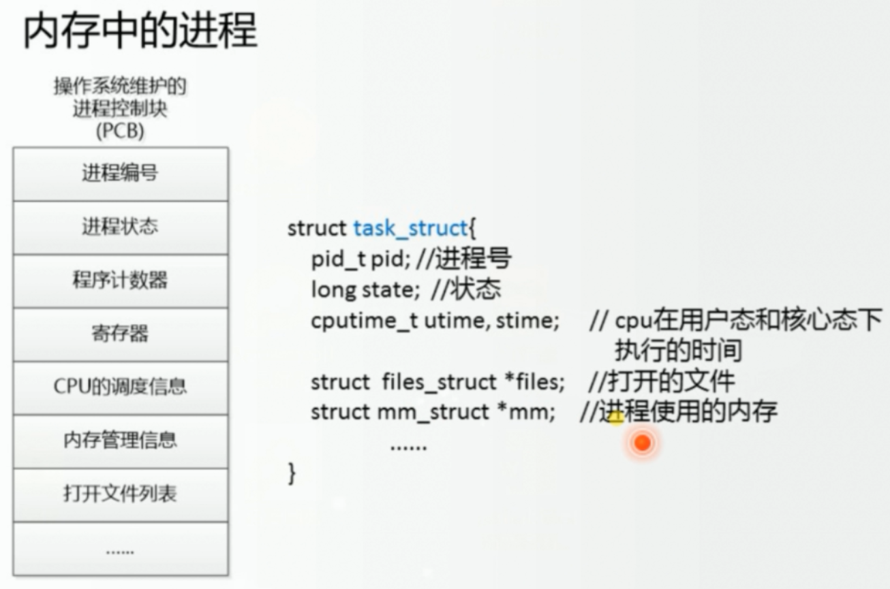
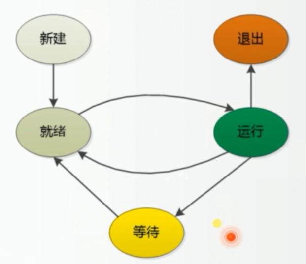
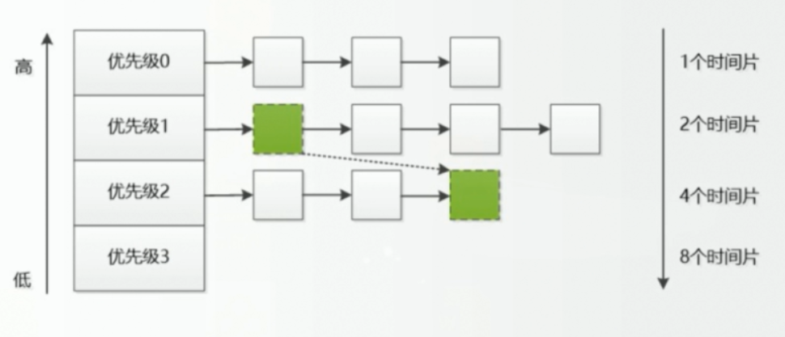

# 进程

#### 进程的介绍

进程就像厨师（CPU）用材料（数据）根据食谱（程序）做蛋糕的动作（进程）。

进程将以一定的数据结构存储在内存中：

    

#### 多进程的执行过程

每个进程都有时间块，为的就是多个进程同时运行，不被某个进程所阻塞。

操作系统会维护一个进程列表，当进程的时间块用完，就会进入就绪状态。当进行IO操作（阻塞），就会进入等待状态

#### 进程调度

进程调度分为两种：非抢占式和抢占式

- 非抢占式：为旧的操作系统，主要用于批处理

- 抢占式：有多种抢占策略，更适用于交互

  - 策略1时间片：时间片选择需要适度，太短则浪费时间在切换上，太长则等待时间过长。

  - 策略2优先级：进程赋予优先级，低优先级的进程可能永远都不会执行（动态优先级：所以等待时间更长，优先级应该被赋予更高）

  - 策略3多级队列反馈：不同级别不同时间片（级别越高，越先执行，时间片越短），根据执行的情况调整进程的级别

    

