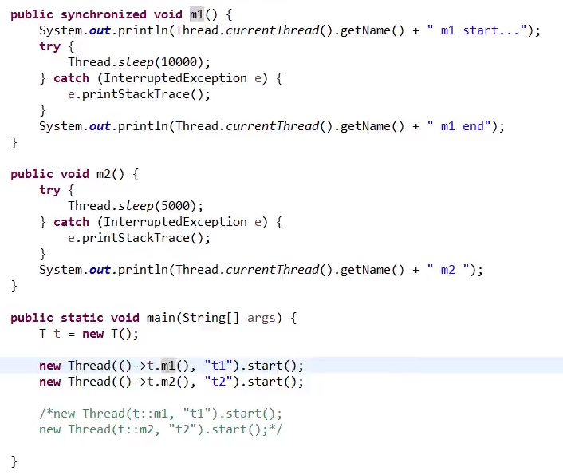
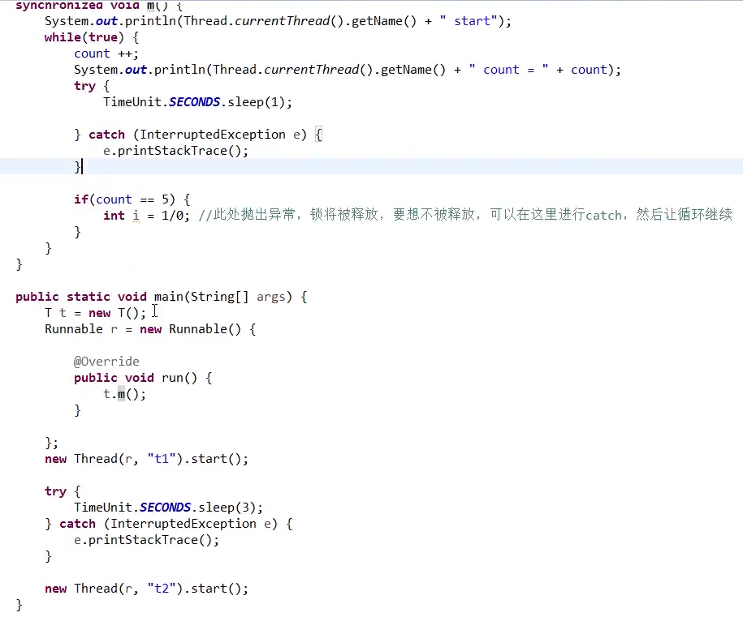

# 加锁synchronized

synchronized的作用就是让代码块具有原子性

  

## 加锁写法

要执行内部代码，需要拿到堆内存中new出来的Object对象的锁

o对象没有实际用途，只是用来获取锁。可以优化代码，用自身做锁：

  

此方法再做优化，省去对象，默认当前类

因为静态方法不能通过``类.方法``访问，所以this将引用不到，需要用class进行锁定（锁静态方法 = 锁类）

  

## 同个class加锁和不加锁方法

加锁了方法a，在多线程的情况下。只是再执行方法a的时候获取不到锁，但是不影响线程去执行方法b（锁定了整个对象，但是方法b不需要拿锁）。

  

## 同个class多个加锁方法

#### 脏读：当写方法加锁，读方法不加锁

会产生**脏读**：就会在写操作还没有执行完的时候，执行了读操作，读出来的数据将不符合预期。处理方式就是对写和读方法都加锁，这时线程获取不到锁只能依次执行读写方法。

#### 重入锁：所有方法加锁，可以重复获取锁

读写方法都加锁，线程并非就不能同时获得两个锁。例如m1加了锁，m1还是可以调用加锁的m2。（不局限于同个类中得方法，也可以子类调用父类）

#### 死锁：多个线程互相等待对方放开锁

线程1执行A方法，等待B方法；线程2执行B方法，等待A方法。

## 同步异常

当多线程的方法中，方法中报了异常，锁将会被释放。所以要处理好异常。

如以上代码，t1线程执行到5的时候抛出异常，锁被释放，将执行t2线程。如果不想因为异常释放锁，加上try...catch捕捉异常。

