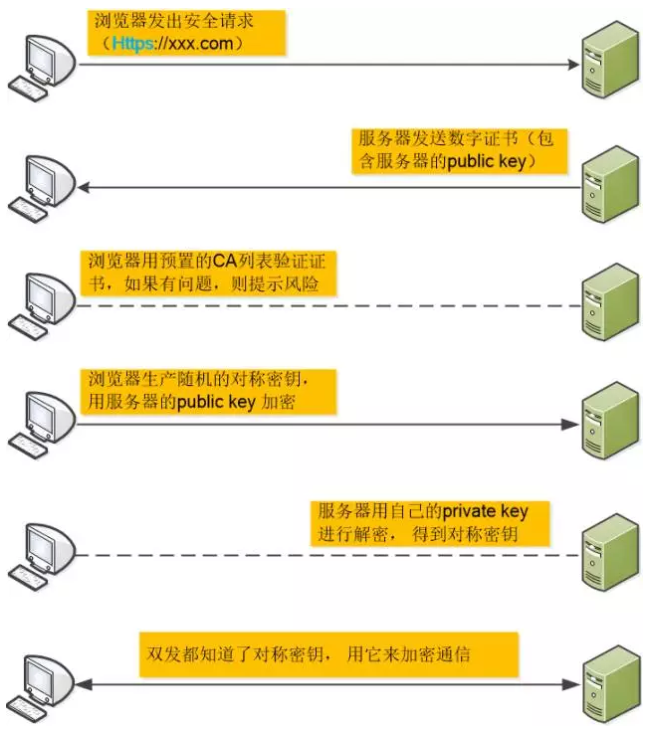

# Https

## 加密算法

### 对称加密算法

双方都用同一个密钥加密，并用该密钥进行解密。

【缺点】：密钥传输给对方时可能会被第三方截获，加密就失去了意义。

### RSA非对称加密

每个私钥对应一个公钥；A方要给B方传信息，只要拿到B方的公钥进行加密，B方用自己的私钥进行解密。在这个过程中，就算数据被截获，没有私钥的第三方也解密不了数据。

【缺点】：RSA加密耗时长

### 对称加密 + RSA非对称加密

为了解决RSA速度慢的特点（比对称加密慢百倍），将对称加密的密钥通过非对称加密进行传输，拿到密钥之后就用对称加密进行通讯

【漏洞】：如果第三方伪装为中间人，拦截A和B的信息传输；那他可以偷偷更换双方发出的公钥，通过自己的私钥解密双方的信息，所有的信息将暴漏给了第三方。

### 数字签名

为了确保数据传输过程中没有第三方中间人，需要有一个认证中心来证明传输方的身份。认证中心发布证书，证书有``公钥 + 个人基本信息``。  

然后用Hash算法将``公钥 + 个人基本信息``生成信息摘要，再对信息摘要进行非对称加密(**签名**)。  

签名将和``公钥 + 个人基本信息``一起作为**数字签名**，传输给了B方。   

B方用认证中心给的公钥将信息摘要解密，然后再将``公钥 + 个人基本信息``进行Hash运算，得出的信息摘要进行对比。对比通过，则说明公钥就是``个人基本信息``里的人传出来的。   

拿到正确的公钥，就可以通过 对称加密 + RSA非对称加密 的方式进行通讯。

【漏洞】：在公钥传给CA过程中，如果第三方伪装为CA，所有的信息将会被拦截修改。还好浏览器/系统内置了顶级的CA证书，保证传输给CA过程不会被拦截。

  

## Nginx配置Https服务器

配置 HTTPS 要用到私钥 example.key 文件和 example.crt 证书文件。

而认证中心生成证书文件需要 example.csr 文件。

### CSR文件

CSR（Cerificate Signing Request）文件包含申请者标识名，公钥信息

用OpenSSL生成CSR文件：

```
openssl req -new -newkey rsa:2048 -sha256 -nodes -out kxjs_com.csr -keyout kxjs_com.key -subj "/C=CN/ST=GuangZhou/L=GuangZhou/O=Kxjs Inc./OU=Web Security/CN=kxjs.hp.gov.cn"
```

参数说明：

- C：Country ，单位所在国家，为两位数的国家缩写，如： CN 就是中国
- ST 字段： State/Province ，单位所在州或省
- L 字段： Locality ，单位所在城市 / 或县区
- O 字段： Organization ，此网站的单位名称
- OU 字段： Organization Unit，下属部门名称;也常常用于显示其他证书相关信息，如证书类型，证书产品名称或身份验证类型或验证内容等
- CN 字段： Common Name ，网站的域名

### CSR文件

将key和csr文件放到nginx服务器指定目录下

```properties
		listen 443 ssl;
		server_name kxjs.hp.gov.cn;
		charset utf-8;
		ssl on;
		ssl_certificate /usr/unify/nginx/ssl/server.crt;
		ssl_certificate_key /usr/unify/nginx/ssl/server.key;
		ssl_session_timeout 5m;
		ssl_protocols SSLv2 SSLv3 TLSv1;
		ssl_ciphers ECDHE-RSA-AES128-GCM-SHA256:HIGH:!aNULL:!MD5;
		ssl_prefer_server_ciphers on;
```

