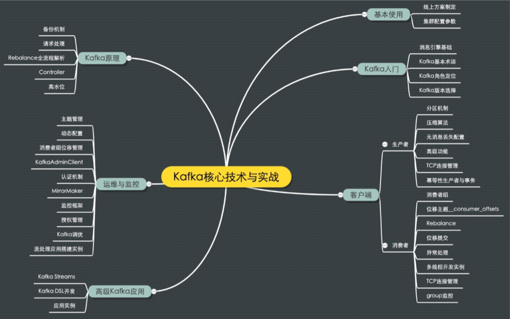
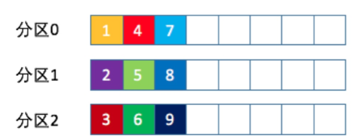
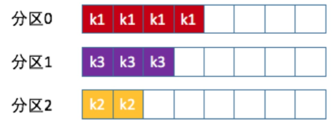

# kafka

   

## Kafka简介

kafka是开源消息引擎系统。通过纯二进制进行消息设计。支持**点对点模型** 和 **发布订阅模型**，作用是：削峰填谷。

### 名词

消息：Kafka处理的主要对象

主题：用来区分业务，所欲消息的逻辑容器

分区：主题可分为多个分区

重平衡：消费者之间可以彼此协助，某个向消费者挂掉，其他消费者自动分配订阅主题分区。但会引发消费者问题。

### 功能简介

#### kafka怎么实现高可用?

- kafka由多个Broker进程组成，当一台机子宕机了，其他机器的Broker也能对外提供服务。（自行实现负载均衡）
- kafka的备份机制，Leader Replica对外提供服务，Follower Replica被动追随领导者副本。 （冗余机制）

#### kafka的处理伸缩性问题

分区：副本机制可以保持数据不丢失，一旦副本太多，单机不够保存。则可以把每个主题可以配置多个分区，每个分区配置多个副本。（多个副本仅一个提供服务，其他做冗余）生产者每条数据只会发送到一个分区中，分区编号从0开始。

#### kafka的数据持久化

Kafka使用消息日志（Log）来 保存数据，仅有写操作，并定时删除旧的日志段。

#### kafka位移

- 分区位移：分区内的消息位置，它是不变的
- 消费者位移：是消费者消费进度的指示器

### Kafka的种类

- Apache Kafka：社区版，迭代快，只提供基础核心组件
- Confluent Kafka：Kafka原班人马打造，有高级特性但普及率低
- CDH/HDP Kafka：内嵌Apache Kafka，操作简单。但把控度低，演进速度慢

## Kafka的实战部署

启动Zookeeper后，启动Kafka。进入``/opt/kafka_2.11-2.0.0/bin/``目录

1. 创建名为test的topic

   ```
   ./kafka-topics.sh --create --zookeeper zookeeper:2181 --replication-factor 1 --partitions 8 --topic test
   ```

2. 指定topic，创建生产者

   ```
   ./kafka-console-producer.sh --broker-list localhost:9092 --topic test
   ```

3. 再起一个系统，指定topic，创建消费者

   ```
   ./kafka-console-consumer.sh --bootstrap-server localhost:9092 --topic test --from-beginning
   ```

生产者中输入内容，消费者窗口即可接收到信息

## 部署系统

### linux和windows的差别

- I/O模型的使用

  Kafka客户端使用了Java的selector，selector在Linux上实现机制是epoll，在window上实现机制是select，在linux上能获得更高效的I/O性能。 

- 数据网络传输效率

  Linux中磁盘和网络之间可以通过零拷贝实现快熟传输。

- 社区支持度

  Window平台上Kafka的BUG一般不会修复

### 磁盘计算

每天1亿条数据（1kb/条），每条两个备份，保存2周：

1. 1亿 * 1KB * 2/1000/1000 = 200GB。
2. 索引等其他数据10%，约为220GB每天。
3. 两周保存时间：220GB * 14 = 3TB
4. Kafka数据压缩比为0.75， 0.75 * 3 = 2.25TB 

## 参数配置

07、08章，再做整理

## 分区机制

用Kafaka收集服务器的日志数据，数据量是很大的，我们希望将数据量均匀分配到Kafka各个Broker上。所以进行了分区，分区可以实现负载均衡。

### 分区策略

自定义分区策略只需要实现``org.apache.kafka.clients.producer.Partitioner``接口，实现的``partition``方法即可。

```java
int	partition(String	topic,	Object	key,	byte[]	keyBytes,	Object	value,	byte[]	valueBytes,	Cluster	cluster);
```

#### 轮询策略

轮询策略是Kafka java生产者默认提供的分区策略（有定义key则用**按消息键保存策略**），为顺序分配

  

  #### 随机策略

代码示例

```java
List<PartitionInfo>	partitions	=	cluster.partitionsForTopic(topic); return	ThreadLocalRandom.current().nextInt(partitions.size());
```

#### 按消息键保存策略

每条消息定义消息键key，同个key存进同个分区



实现代码如下：

```java
List<PartitionInfo>	partitions	=	cluster.partitionsForTopic(topic); return	Math.abs(key.hashCode()) % partitions.size();
```

多分区是会扰乱消息的因果关系的，而专门的分区策略可以保证消息的顺序，又可以享用多分区的性能红利。

#### 自定义策略案例

根据地域分区的方式，通过IP地址区分南方北方。示例代码如下：

```java
List<PartitionInfo> partitions = cluster.partitionsForTopic(topic); 
return partitions.stream().filter(p -> isSouth(p.leader().host())).map(PartitionInfo::partition).findAny().get();
```

## 生产者压缩算法  

Kafka由V1和V2版本两类消息格式。V2版本笔V1版本节省磁盘空间，压缩效果也更为显著。

### 压缩

压缩可能发生在两个地方：生产者端 和 Broker端

生产者压缩很正常，一般Broker无需压缩，Broker端需要压缩的原因是：

- Broker端和Producer端使用不同的压缩算法

  Broker接收压缩消息后，需要解压再压缩，导致CPU飙升。所以Broker端和Producer端的``compression.type``值需要保持一致。

- 兼容旧版本消息

  接收到V2消息后进行解压缩，转换为V1消息，然后再进行压缩。（还会丧失ZeroCopy特性）

### 解压缩

Producer端压缩 -- >Broker端保持 --> Consumer端解压缩

压缩算法会封装到消息集合中，Consumer读到消息集合，就知道是哪种压缩算法。

Broker端写入时也会进行解压缩，对消息进行校验，这是保证把事情做对的方式。

### 压缩算法

Kafka支持的压缩算法：GZIP、Snappy和LZ4、 Zstandard（zstd）

性能测试结果：

- 吞吐量方面：LZ4	>	Snappy	>	zstd和GZIP

- 压缩比方面，zstd	>	LZ4	>	GZIP	> Snappy。

- 物理资源，使用Snappy算法占用的网络带宽最多，zstd最少

- CPU使用率方面，各个算法表现得差不多，只是在压缩时Snappy算法使用的CPU较多一些，而在解压缩时GZIP算法则可能使用更多的CPU。

  带宽是比CPU和内存还要珍贵的稀缺资源，所以压缩必须打开。


11


