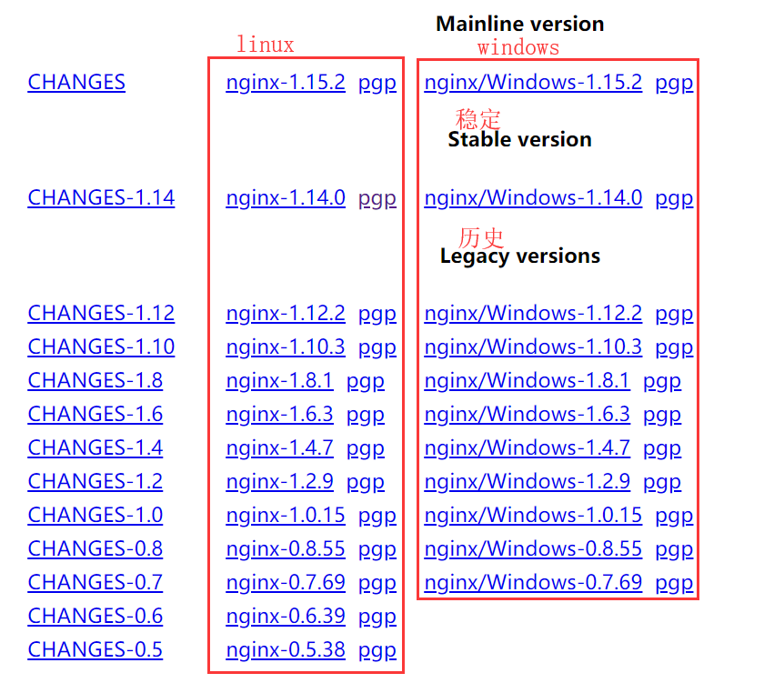

# nginx  

D：nginx有什么作用？

Z：以下三种作用：

http服务器：提供http服务，像静态服务器。

虚拟主机：同个ip有多个网站，可以虚拟出多个主机，根据域名进行区分。

反向代理：一个网站，多台服务器同时进行提供同一服务，nginx进行代理操作，实现负载均衡（可以设置多台服务器，不同的权重）。

### 安装nginx  

M：linux下怎么安装nginx？

Z：如下步骤

1. 首先下载nginx   

       

2. 上传到服务器，解压nginx文件 ``tar -zxvf nginx-1.8.0.tar.gz``   

3. 参数配置   

   ```properties
   ./configure \
   --prefix=/usr/local/nginx \
   --pid-path=/var/run/nginx/nginx.pid \
   --lock-path=/var/lock/nginx.lock \
   --error-log-path=/var/log/nginx/error.log \
   --http-log-path=/var/log/nginx/access.log \
   --with-http_gzip_static_module \
   --http-client-body-temp-path=/var/temp/nginx/client \
   --http-proxy-temp-path=/var/temp/nginx/proxy \
   --http-fastcgi-temp-path=/var/temp/nginx/fastcgi \
   --http-uwsgi-temp-path=/var/temp/nginx/uwsgi \
   --http-scgi-temp-path=/var/temp/nginx/scgi
   ```

   上边将临时文件目录指定为/var/temp/nginx，需要在/var下创建temp及nginx目录  

4. 执行参数配置之后会出现MakeFile，执行编译安装

   ```
   make
   make  install
   ```

5. 执行nginx命令：``./nginx``

M：为什么使用参数配置执行失败？

Z：缺漏了一些命令，需要分别进行安装。

M：怎么停止nginx进程呢？

Z：除了可以直接kill掉，还可以使用``./nginx -s quit``停止，win下用``nginx.exe -s stop``  

M：win下怎么用命令启动nginx呢？

Z：``start nginx.exe``   

M：如果我修改了ngixn配置文件，怎么重新加载呢？

Z：win下用``nginx.exe -s reload``  

### 高可用   

M：怎么实现负载均衡呢？

Z：配置nginx即可

```properties
worker_processes  1;

events {
    worker_connections  1024;
}

# 所有请求都会进入http
http {  
    include       mime.types;
    default_type  application/octet-stream;
	# 设置每个节点超时时间
	# proxy_connect_timeout 1;

    sendfile        on;

    keepalive_timeout  65;

    server {
    	# 后台系统域名	server_name xxx.xxx.com
    	 
    	# 监听80端口
        listen 80;
        # 所有的请求 / 
        location / {
        	# 指向地址组
			proxy_pass http://tomcat_server_pool;   
        }
    }
	
	# 设置多个结点
	upstream tomcat_server_pool{
        server 127.0.0.1:8080 weight=1;
        server 127.0.0.1:32772 weight=1;
		server 127.0.0.1:32780 backup;
    }

}
```

M：设置了结点超时时间，访问一个结点在限定时间内没有返回结果，才会访问backup。   

M：结点位置不能设置项目名，要在什么地方设置项目名呢？

Z：location的位置   

```properties
        location  ^~ /SUPPLYWeb/ {
            proxy_pass http://server_pool;
        }

```

