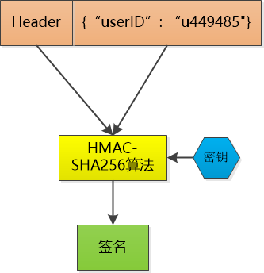
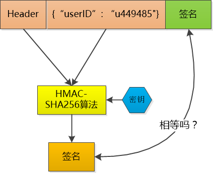

# session & token & cookie

### session

session的出现是为了区分不同用户的Http请求，让Http请求从无状态变为又状态。

session存储在服务器上对服务器造成了不少的负担，还不利于服务器的扩展，所以将session id存储到客户机上。

### token

但是存储在客户端可能被别人恶意伪造，所以需要对签名进行加密，作为token传给用户。

  

token的验证，服务的对信息再做一次加密，与客户端传来的信息进行比对，确认是否通过验证

  

### cookie

cookie是浏览器的存储功能，由服务端生成，发送给浏览器。每个域的cookie数量是有限的。

cookie存储了session信息。   