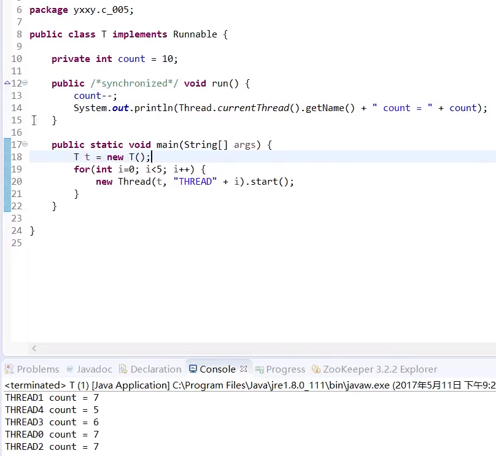
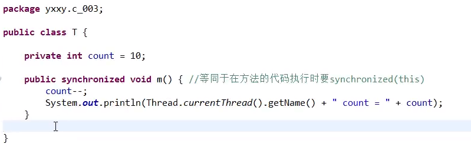
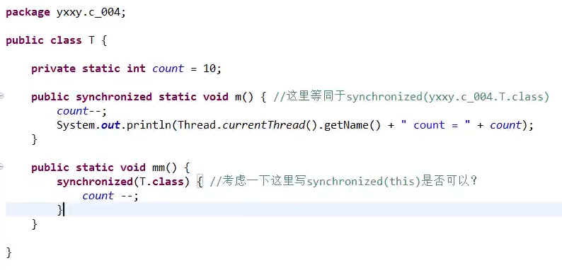

# 线程

### [进程](component/process.md)  

每个程序相当于一个进程，进程有自己的内存地址。

### 线程

线程是代码的执行，一个进程可能有多个线程。

  

进程是隔离的,占一个内存地址。线程可以共享数据，用的是进程的内存地址。 

### 加锁synchronized

synchronized的作用就是让代码块具有原子性

  

#### 加锁写法

要执行内部代码，需要拿到堆内存中new出来的Object对象的锁

o对象没有实际用途，只是用来获取锁。可以优化代码，用自身做锁：

  

此方法再做优化，省去对象，默认当前类

因为静态方法不能通过``类.方法``访问，所以this将引用不到，需要用class进行锁定（锁静态方法 = 锁类）

  

https://www.bilibili.com/video/av33688545/?p=19

码农翻身书籍P21

线程安全的资料

https://blog.csdn.net/suifeng3051/article/details/52164267

