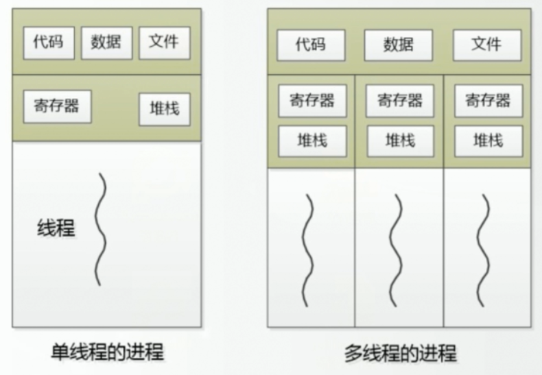
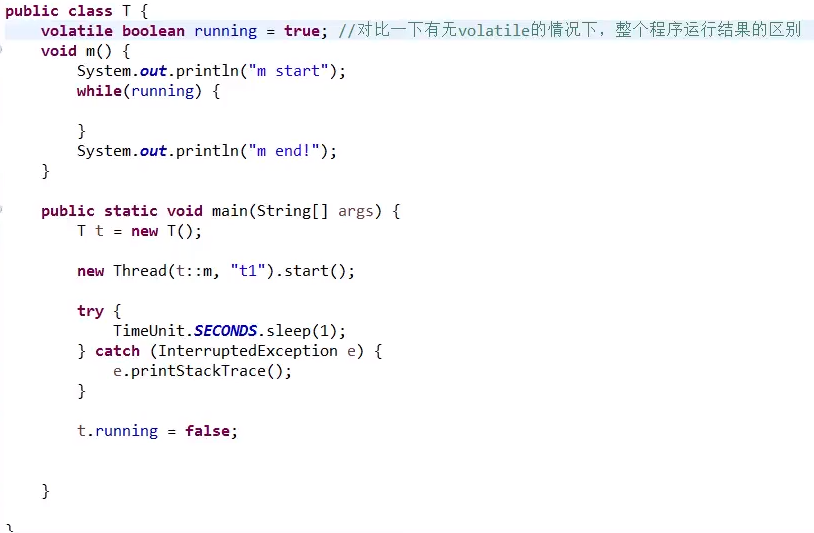
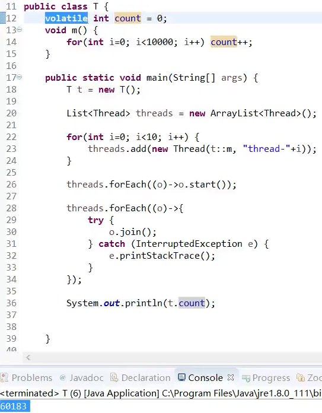

# 线程

### [进程](component/process.md)  

每个程序相当于一个进程，进程有自己的内存地址。

### 线程

线程是代码的执行，一个进程可能有多个线程。

  

进程是隔离的,占一个内存地址。线程可以共享数据，用的是进程的内存地址。 

### 加锁[synchronized](component/synchronized.md)  

synchronized可以让代码块具有原子性，对部分方法加锁可能会产生脏读，对多个方法加锁可能会产生死锁。  

### 线程可见volatile

如果不给变量添加volatile，线程之间就是不可见的，running将不会变成false，线程t1将永远不会结束。

  

因为在JMM(java内存模型)中，running变量会被存入到cpu的缓存区内。而其他线程修改内存上的running值将不会影响cpu中缓存区的running变量。

当while代码块中cpu有了空闲时间，它将会取内存中读值。或者添加volatile修饰，在running变量发生改变的时候，主线程会去通知t1线程取更新running的值。

#### volatile与synchronized的比较

能用volatile就不要加锁，并发效果有提高很多。但是volatile只有可见性，而synchronized具有可见性和原子性。

volatile不具有原子性表现如下：

  

虽然线程从内存读取的数据是实时的，但是不保证在写入的

<https://www.bilibili.com/video/av33688545/?p=21>

码农翻身书籍P21

线程安全的资料

https://blog.csdn.net/suifeng3051/article/details/52164267

