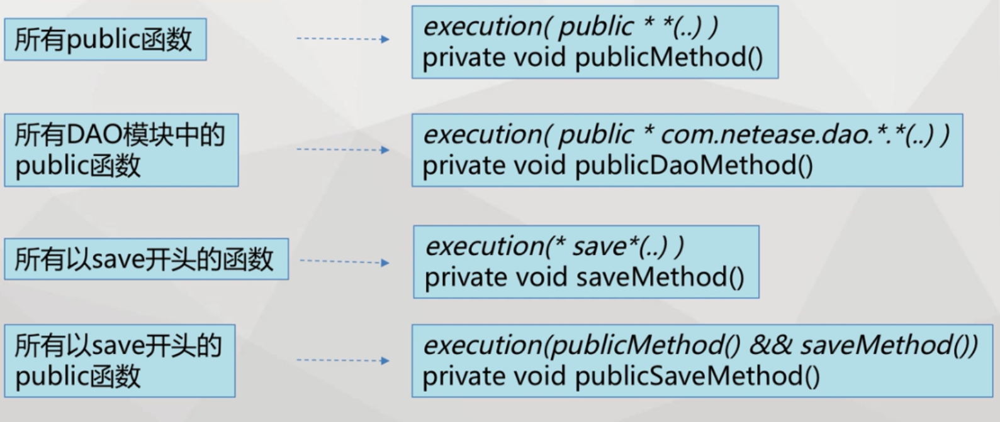
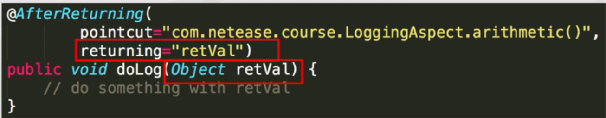
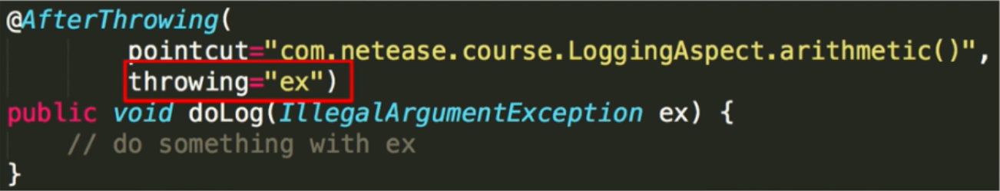
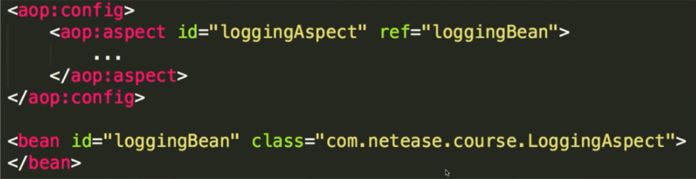
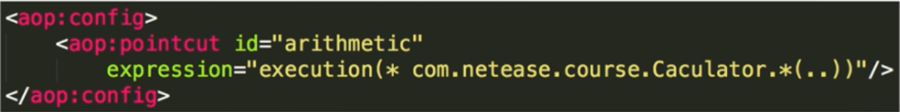
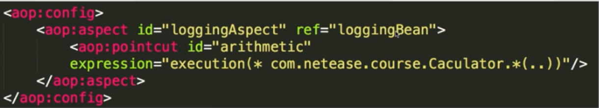
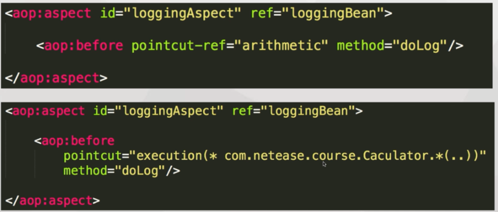
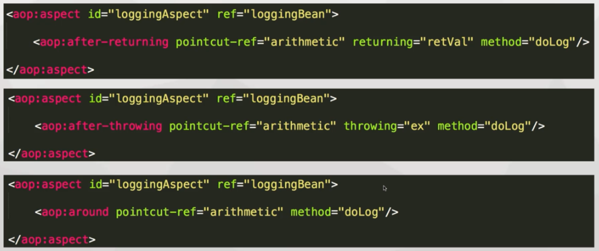

# AOP面向切面   

## 1.AOP的介绍   

AspectJ是一套Java语言的扩展系统，开发者无需使用预编译器或其他的元标签，在Java程序中应用AOP，面向对象编程的补充和完善。   

  

_简单来说就是将日志，安全之类的代码从逻辑代码中抽离出来，利用切入的方式插入程序中。就像录音机的录音带和录音机的分离，插进去可以当录音机，拔出来可以当收音机，这样就实现了解耦_  

## 2.Aop的例子   

### 1.使用aop的schema，添加bean配置  

```xml
<?xml version="1.0" encoding="UTF-8"?>
<beans xmlns="http://www.springframework.org/schema/beans"
	xmlns:xsi="http://www.w3.org/2001/XMLSchema-instance" xmlns:aop="http://www.springframework.org/schema/aop"
	xsi:schemaLocation="http://www.springframework.org/schema/beans
	http://www.springframework.org/schema/beans/spring-beans-2.0.xsd
	http://www.springframework.org/schema/aop
	http://www.springframework.org/schema/aop/spring-aop-2.0.xsd">

	<aop:aspectj-autoproxy />

	<bean id="loggingAspect" class="cn.leekoko.course2.LoggingAspect"></bean>
	<bean id="caculator" class="cn.leekoko.course2.Caculator"></bean> 
</beans>
```

<aop:aspectj-autoproxy />开启@Aspect支持   

_schema用来规范配置文件的格式，类似模板的作用_    

### 2.编写运行类   

```java
public class Caculator {
	public int add(int a, int b){
		return a + b; 
	}
	
	public int sub(int a, int b){
		return a - b;
	}
}
```

### 3.添加aspectj和spring-aop依赖   

```xml
	<dependency>
	    <groupId>org.aspectj</groupId>
	    <artifactId>aspectjweaver</artifactId>
	    <version>1.8.7</version>
	</dependency>

	<dependency>
	    <groupId>org.springframework</groupId>
	    <artifactId>spring-aop</artifactId>
	    <version>4.2.1.RELEASE</version>
	</dependency>
```

### 4.添加注解，编写日志打印功能    

```java
@Aspect
public class LoggingAspect {
	/**
	 * 定义好打日志功能
	 * @param jp
	 */
	@Before("execution(* cn.leekoko.course2.Caculator.*(..))")
	private void arithmeticDoLog(JoinPoint jp) {
		System.out.println(jp.toString());
	}
	
	
}
```

1. 注意 : JoinPoint的导包为：``org.aspectj.lang.JoinPoint``      

2. 添加@Aspect注解到执行方法的类级别上

   _让spring可以发现切面_  

3. 定义切面触发   

被指定的pointCut``"execution(* cn.leekoko.course2.Caculator.*(..))"``一旦执行，就会顺带执行arithmeticDoLog方法，pointCut的类型：

  

4. 至于是执行前还是执行后触发，由注解类型决定：

@Before   方法执行前执行

@AfterReturning  方法执行完执行

@AfterThrowing   方法异常时执行  

@After  方法最后执行   

(注解+pointCut+方法=Advice)

5. 获取上下文信息   

- 添加JoinPoint，spring就会将上下文信息自动匹配进来   

@Around要添加的参数是   ProceedingJoinPoint   

- 当要获取方法执行之后的返回值    

   

- 获取抛出的异常信息  

   

### 5.调用运行类，输出以下结果：  

```
execution(int cn.leekoko.course2.Caculator.add(int,int))
2
execution(int cn.leekoko.course2.Caculator.sub(int,int))
3
```

## 3.Schema的Aop

Aop有两种方式：@AspectJ   &   Schema   

上面的例子是使用@AspectJ实现的，而Schema可以集中管理  

_@AspectJ使用注解配置，Schema使用配置文件配置_

### 1.Schema定义Aspect   

相当于@Aspect   

   

### 2.定义pointCut

   

也可以和Aspect组合一起写：   

  

### 3.定义Advice      

通过名称来引用pointCut（图1），也可以直接表达式引用（图2）   

  

（其他捕捉类型）   

   

