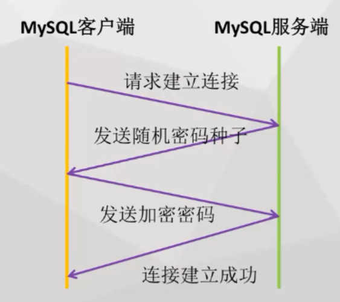

# 连接池

## 1.建立连接   

_本文的主人工是连接池，他管理了搬砖工取数据库取砖的过程。_  

当我们执行conn=DriverManager.getConnection的时候，其实是进行了客户端与服务端一系列的交互操作。  

  

我们普通jdbc直接访问数据库，每次都会创建一次连接，而跨机器的网络传输需要花费较多的时间，因此会花费大量的时间在建立连接上。

- 如果能用**连接池**来管理数据库的连接，当线程需要访问数据库就往连接池租借连接，用完再还给**连接池**。  
- 当一次访问数据库的连接太多，就会导致程序内存溢出。而**连接池**就可以对连接进行管理，当连接需求较少就会销毁连接，连接需求较多就会增加连接，更多则进行限流，排队等待操作。  

_继续拿前面jdbc的例子，你们砖厂每个搬砖的人每次拉着手扶车去数据库拿砖都要办个认证手续（连接），它可以防止砖块被别人冒领走。但是认证手续又非常繁琐(像上图)。所以老板就想出一个办法，派一个人专门来整理手续问题（连接池）。连接池它办的手续除了可以给你自己用，还可以给你的工友用，是一种循环利用的方式。当然手续一段时间内只能被一个人使用，不能多人同时用。所以连接池想到一个方法就是就是办多个手续，当然也不能无限，否者就会数据库奔溃。所以当多个手续还是不够用的时候，搬砖工就只能再连接池的指导下排队等候，等那些用完手续的人把手续还回来。_   

## 2.dbcp连接池   

一般我们使用的是dbcp连接池  

DBCP连接池所需jar包：

1. commons-dbcp.jar
2. commons-pool.jar
3. commons-logging.jar  

连接池的操作对象为BasicDataSource，因为其底层为jdbc，所以必要的信息跟jdbc一样：url,DriverName,数据库用户名，密码。   

BasicDataSource的常用方法：

- setInitialSize()设置初始化连接数  
- setMaxTotal()设置最大连接数(限流保护数据库)  
- setMaxWaitMillis()设置最大等待时间(设置小于服务器自动关闭的时间)    


- setTestWhileIdle(Ture)开启检查功能  
- setMinEvictableIdleTimeMills()超过设定时间会被连接池销毁   
- setTimeBetweenEvictionRunsMillis()检查运行时间的间隔  

服务端会默认关闭空闲一定时间的连接(mysql默认为8h)。而连接池不知道，还把失效的连接租借出去，就会抛出异常。所以要在服务器端关闭连接之前就把连接池的连接销毁掉。 

_可是也不能让工友就那样无限时地等候下去，万一排队的人特别多呢。所以就需要设定等待的时间（setMaxWaitMillis），一旦等了那么就，就告诉工友:今天是轮不到你了，你先下班吧~而当遇到人比较少的淡季，那很多手续都闲置了很久，而数据库会把这些闲置一段时间的手续给取消掉。为了配合数据库的工作，连接池也会设定好空闲时间(setMinEvictableIdleTimeMills)，当手续空闲达到这么多天，就注销掉手续。否者工友拿着失效的手续单去取砖，就会被数据库踹回来。_   

代码示例：

```java
	static String DB_URL="jdbc:mysql://localhost:3306/test";
	static final String USER="root";
	static final String PASSWORD="123456";
	
	public static BasicDataSource ds=null;
	
	public static void InitJdbc(){    //1.初始化连接池配置
		ds=new BasicDataSource();
		ds.setDriverClassName("com.mysql.jdbc.Driver");
		ds.setUrl(DB_URL);
		ds.setUsername(USER);
		ds.setPassword(PASSWORD);
		ds.setMaxActive(2);
	}
	
	private static void helloword() throws ClassNotFoundException {
		Connection conn=null;
		Statement stmt=null;
		ResultSet rs=null;
		try {
			conn=ds.getConnection();    //2.使用连接池建立连接
			//执行sql语句
			stmt=conn.createStatement();
			rs=stmt.executeQuery("select * from user");
			while(rs.next()){
				System.out.println(rs.getString("userName"));
			}
		} catch (SQLException e) {
			//异常处理
			e.printStackTrace();
		}finally {
			//清理环境
			try {
				if(conn!=null){
					conn.close();
				}
				if(stmt!=null){
					stmt.close();
				}
				if(rs!=null){
					rs.close();
				}
			} catch (SQLException e) {
					//ignore
			}
		}
	}
	public static void main(String[] args) {
		try {
			InitJdbc();
			helloword();
		} catch (ClassNotFoundException e) {
			// TODO Auto-generated catch block
			e.printStackTrace();
		}
	}
```

这里主要和jdbc的区别就是：  

1. 初始化连接池配置    
2. 使用连接池建立连接  


