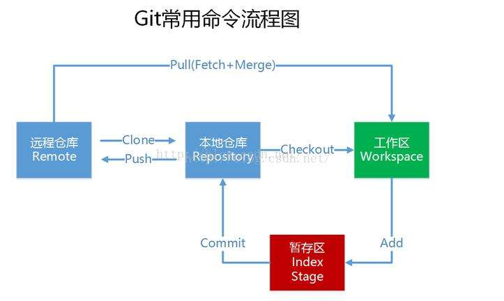

# Git协作   

git版本系统就是把每个版本保存到仓库里，目的是为了任何时间回溯版本。

_打游戏的时候打boss前进行存档，然后挂了可以重新回到存档位置_  

### 1.查看状态区别代码：

1. 工作目录和暂存区差别：git diff --cached
2. 暂存区和本地仓库的差别：git diff
3. 工作目录和本地仓库区别：git diff HEAD

  

_git的运行原理:作目录随意修改，然后add保存到本地看不见的暂存区，再commit提交到本地版本库，最后一并push推送到服务器上的仓库上。上面代码就是对比四个地方的内容差异。_     

### 2.查看提交记录代码   

最近10次提交记录：``git hi -10``

### 3.回撤操作 

reset主要是处理“工作区--暂存区--版本库”三个位置，不涉及远程仓库  

#### 1.回撤暂存区内容到工作目录   

- 暂存区回撤到工作目录，工作目录保留：

``git reset HEAD``   

_我先上传（存档1），然后做个修改A，传进暂存区中(存档2)。但是10秒钟之后又修改了B。那么先用该命令让暂存区回到修改A之前的存档（存档1），再次将A,B修改一并上传（存档3）_     

- 相似的，把暂存区回撤过来，把工作目录抛弃：

``git checkout``   

_发现代码写错了，需要回撤版本到之前_

#### 2.回撤版本库到暂存区   

``git reset HEAD^ --soft``   

_我提交了代码555到仓库，但是我想拉回来。用改代码就可以把555返回到暂存区里面。_ 

#### 3.回撤版本库，放弃变更   

``git reset 编码 -hard``  

_跟上面区别就是，撤掉的内容之间消失，而不是到暂存区。意思就是将编码所在版本作为仓库的最新版本。神奇的是：比如撤掉555，只要输入555的哈希值，可以执行反回撤_ 

#### 4.回撤远程仓库

谨慎操作：把本地仓库强制性地变成远程仓库   

``git push -f``   

_今天，我做了错误的操作，然后还提交上去了。为了回到之前的样子，我先将本地仓库变更修改到昨天的提交。然后强制推送到远程使其同化。_    

#### 5.回撤上一次提交   

``git commit --amend -m "message"``   

_和上一次提交一起合并提交commit_  

#### 6.变基操作，改写历史提交     

``git rebase -i HEAD~3``   

_穿越时空，修改代码_   

回撤操作最好在本地完成，否者会影响协作过程。（别人可能拿你错误的代码去开发）  

下面学习  分支操作，团队协作  

