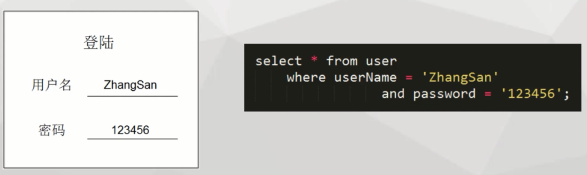
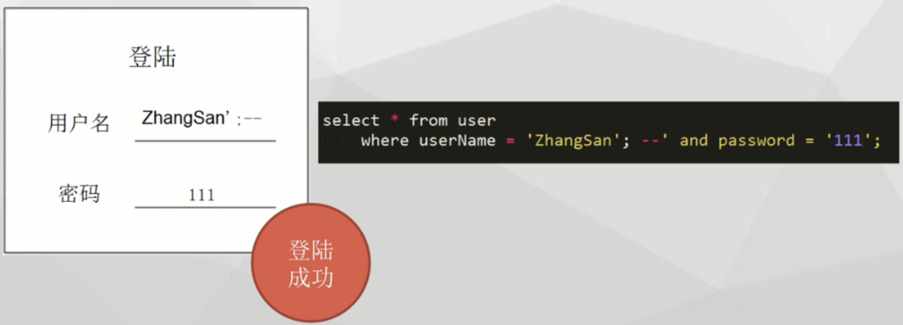

# SQL注入   

## 1.什么是SQL注入   

- 看一下下面的案例场景，这是正常情况下的登陆场景：

  

- 而当我们使用   用户名‘：--   的时候，密码随便输入也可以登陆成功↓

  

- 这时候对比两条sql就能发现，其实用户通过在用户名写入的sql符号将内部sql提前结束，并且将后半句检索条件注释起来达到免密码登陆效果。

_sql注入就是本来我只有我能操作数据库，本来只是让你输入内容就走，而你却输入命令，从而在我不知情下操作数据库_    

## 2.漏洞的修复  

- 会产生上门面的情况是因为上面的sql是使用动态拼接的方式，所以sql传入的方式可能改变sql的语义。   

_动态拼接就是在java中java变量和sql语句混合使用:select * from user where userName='"+userName+"’ and password = '"+password"'_   

- 所以要使用preparedStatement的参数化sql，通过先确定语义，再传入参数，就不会因为传入的参数改变sql的语义。（通过setInt，setString，setBoolean传入参数）   

## 3.参数化sql使用案例   

```java
			//建立数据连接
			conn=ds.getConnection();
			//1.设置prepareStatement带占位符的sql语句
			PreparedStatement ptmt = conn.prepareStatement("select * from user where userName = ? and password = ?");
			ptmt.setString(1, "张三");      //2.设置参数
			ptmt.setString(2, "123456");
			rs=ptmt.executeQuery();     
			
			while(rs.next()){
				System.out.println("登陆成功");
				return;
			}
			System.out.println("登陆失败");
```

参数化特点：

1.设置prepareStatement带占位符的sql语句

statement执行sql语句的方式：

```java
stmt=conn.createStatement();
rs=stmt.executeQuery("select userName from user");
```

2.设置参数

_PerpareStatement继承于Statement，这里主要使用的使他参数化sql的特性。_   


