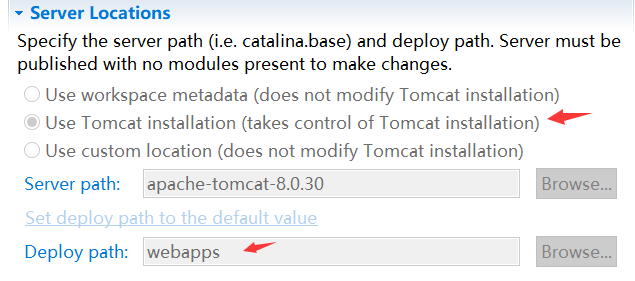

# IOC控制反转   

## 1.IOC的介绍   

1. DI是IOC的另外一种表示方式，其中：

- DI是目标：依赖注入   
- IOC是方式：控制反转    

所谓的去控制反转就是将对象的使用者从自身交给了Ioc容器    

_我们是饺子厂商，主要卖有两种饺子。一种是包装的，包什么馅料由我们决定，这就像我们普通的对象使用方式。但是由于有的买家喜欢不同口味的馅料，为了让买家吃得更加灵活，并且降低生产成本，所以就只生产饺子皮，让买家自己去包饺子。这就像将肉馅的控制权限交给了用户，是一种控制反转。_   

2. IOC和非IOC的对比：

  

## 2.AOP的介绍  

将业务逻辑和非业务逻辑分开来写，但是运行的时候要一起运行。   

Spring模块  

    

- Core Container:创建对象，组装依赖，生命周期的管理，上下文环境  
- Aop，Aspects等整行：Aop实现，AspectJ支持   
- Data Access：JDBC的支持（连接管理，异常处理），事务管理，ORM整合      
- Web：Servlet Based MVC ，Web工具支持，模块支持

## 3.Spring的使用   

### 1.新建maven工程   

- 选择简单工程，使用war包/使用jar    

> jar包相当于一个个的类集合成一个包，当你使用某些功能时就需要这些jar包的支持，需要导入jar包。
> war包是web工程中对web应用的一个打包，目的是节省资源，提供效率，把war包方法到服务器指定文件夹中，war包会自动生成一个web应用，十分方便。

_jar包相当于一个零件，而war包相当于整个产品。就像一辆汽车，jar包发动机也可以作为一款单独的产品，但是它主要还是用来与其他零件配合来构建汽车的（war包）_    

- 解决新建报错：缺少web.xml，右键项目选择Generate Deployment Descriptor Stub    
- tomcat运行注意修改其配置     

   

### 2.添加pom依赖   

```xml
<project xmlns="http://maven.apache.org/POM/4.0.0" xmlns:xsi="http://www.w3.org/2001/XMLSchema-instance" xsi:schemaLocation="http://maven.apache.org/POM/4.0.0 http://maven.apache.org/xsd/maven-4.0.0.xsd">
  <modelVersion>4.0.0</modelVersion>
  <groupId>cn.leekoko.course</groupId>
  <artifactId>spring-container</artifactId>
  <version>0.0.1-SNAPSHOT</version>
  
  <dependencies>  
	<dependency>
	    <groupId>org.springframework</groupId>
	    <artifactId>spring-context</artifactId>
	    <version>4.2.1.RELEASE</version>
	</dependency>
	
  </dependencies>
      
</project>
```

_引入spring相关jar包的过程_   

### 3.在sources中新建application-context.xml   

```xml
<?xml version="1.0" encoding="UTF-8"?>  
<beans xmlns="http://www.springframework.org/schema/beans" 
	xmlns:context="http://www.springframework.org/schema/context" 
	xmlns:xsi="http://www.w3.org/2001/XMLSchema-instance" 
    xmlns:p="http://www.springframework.org/schema/p" 
    xsi:schemaLocation="  
    http://www.springframework.org/schema/context  
    http://www.springframework.org/schema/context/spring-context.xsd  
    http://www.springframework.org/schema/beans  
    http://www.springframework.org/schema/beans/spring-beans.xsd">  
    
    
</beans>    
```

_为了xml文件的规范合法，需要引入命名空间和标签规范_  	

### 4.新建bean类   

```java
public class ScrewDriver {
	public void use(){
		System.out.println("Use screwdriver");
	}
}
```

### 5.在application-context.xml中添加bean  

```xml
    <!-- 定义bean -->
    <bean id="screwDriver" class="cn.leekoko.course.ScrewDriver"></bean>
```

### 6.测试代码   

```java
public class TestContainer {
	public static void main(String[] args) {
		//获取ioc容器
		ApplicationContext context=
				new ClassPathXmlApplicationContext("application-context.xml");
		ScrewDriver screwDriver=context.getBean("screwDriver",ScrewDriver.class);
		screwDriver.use();
	}

}
```

通过读取application-context文件获取ioc容器，用ioc容器获取bean类，执行bean类的方法。   

_配置文件的bean就像是类中的bean的遥控器，所以main方法通过操纵遥控器来控制类中的bean_    

### 7.作用域   

- singleton：bean的配置默认就是singleton，也可以添加scope="singleton"设立。 

只有一个对象：在声明一次对象之后，就算多次声明，也不会改变其属性值。    

- prototype：添加scope="prototype"

每次获取都是一个新的对象，状态不共享  

- request scope：一次访问产生一个，request结束销毁   
- session scope：在session期间，会话都有效   
- application scope：在整个application中只有一个实例   

_作用域就是对象的有效范围：prototype只能用一个，singleton多个都是同一个_

### 8.回调   

有好几个时期的回调，在不同的时期执行，例如执行前、执行后      

#### 使用方式：

1. 在bean类中编写回调方法   

```java
	public void init(){
		System.out.println("init screwdriver");
	}
```

2. bean中添加 init-method="init"指向初始化方法   

```xml
<!-- 定义bean -->
    <bean id="screwDriver" class="cn.leekoko.course.ScrewDriver" init-method="init"></bean>
```

_就像在对接机器人（类）和遥控器（配置bean）的时候，添加一个组合技能的按钮init方法，按下之后就会执行一系列的操作_    

### 9.手动注入方式  

强依赖使用构造函数，可选依赖使用Setter方法  

_像饺子中的饺子皮是必须的，这是强依赖。而馅料可以选择添加香菜，姜等数不尽的配料，这是可选依赖_     

#### 1.构造函数注入的例子   

##### 1.定义接口   

```java
public interface Header {
	public void doWork();
	public String getInfo();
}
```

_因为直接用遥控器控制机器人功能太有限，所以就使用一个核心管理器(接口)控制机器人，而遥控器直接控制核心管理器就可以了，这样就可以扩展更多的功能。像一开始只能控制手摆动，扩展之后可以控制摆动的幅度大小。_   

##### 2.新建实现类   

```java
public class StraightHeader implements Header{
	private String color;
	private int size;
	public StraightHeader(String color,int size){
		this.color=color;
		this.size=size;
	}
	
	public void doWork() {
		System.out.println("Do work with straight header");
	}

	public String getInfo() {
		return "StraightHeader：color"+color+",size="+size;
	}
	
}
```

用一个类实现该接口   

##### 3.在application-context.xml中添加bean

```xml
    <bean id="header" class="cn.leekoko.course.StraightHeader">
    	<constructor-arg value="red"></constructor-arg>
    	<constructor-arg value="15"></constructor-arg>
    </bean>
```

constructor-arg用来给**构造函数 **传值，确定顺序可以用：index="1",type="java.lang.String",name="size"       

_因为本来遥控器按“手按钮”就是抬手，为了更加精度地控制机器人手臂摆动地幅度。就需要输入数据，而数据的输入就在于遥控器输入（配置文件配置)_          

##### 4.调用方法执行      

```java	
		Header header=context.getBean("header",StraightHeader.class);
		System.out.println(header.getInfo());
		header.doWork();
```

#### 2.Map的注入  

##### 1.编写传集合的构造函数   

```java
	public StraightHeader(Map<String, String> paras){
		this.color=paras.get("color");
		this.size=Integer.parseInt(paras.get("size"));
	}
```

##### 2.配置注入集合    

```xml
    	<constructor-arg>
    		<map>
    			<entry key="color" value="red"></entry>
    			<entry key="size" value="14"></entry>
    		</map>
    	</constructor-arg>
```

跟map类似的还有props，其子标签未prop   

#### 3.List注入   

##### 1.编写注入的list

```xml
    	<constructor-arg>
    		<list>
    			<value>red</value>
    			<value>14</value>
    		</list>
    	</constructor-arg>
```

除了List，也可以用Set    

##### 2.编写传List的构造方法   

```java
    	<constructor-arg>
    		<list>
    			<value>red</value>
    			<value>14</value>
    		</list>
    	</constructor-arg>
```

#### 4.从配置文件读取注入   

从properties文件读取   

#####  1.在application-context.xml中添加properties配置文件的读取    

```xml
    <bean id="headerProperty" class="org.springframework.beans.factory.config.PropertyPlaceholderConfigurer">    
        <property name="location" value="classpath:header.properties">    
        </property>    
    </bean>    
```

读取的文件名称为

_插入header.properties内存卡_   	

##### 2.在resources中添加header.properties配置文件   

```xml
color=green
size=16
```

使用键值对的方式

##### 3.注入之后在application-context.xml中就可以调用对应的值

```xml
    <bean id="header" class="cn.leekoko.course.StraightHeader">
    	<constructor-arg name="color" value="${color}"></constructor-arg>
    	<constructor-arg name="size" value="${size}"></constructor-arg>
    </bean>
```

用${size}对值进行提取    

_这个输入值可以编写在一个（内存卡）properties中，从properties中读取出来录入到遥控器中_   

#### 5.bean类型的依赖注入    

##### 1.在实现类中声明注入的类，添加构造函数   

```java
	private Header header;
	
	public ScrewDriver(Header header){    //编写bean的构造函数
		this.header=header;
      	 header.doWork();
	}
```

##### 2.通过配置文件中注入bean   

```xml
    <!-- 定义bean -->
    <bean id="screwDriver" class="cn.leekoko.course.ScrewDriver" init-method="init">
    	<constructor-arg>
    		<ref bean="header" />
		</constructor-arg>
    </bean>
```

这样在ScrewDriver中就能获取header的信息   

#### 6.使用setter方式注入   

##### 1.修改bean配置为property      

```xml
    <bean id="header" class="cn.leekoko.course.StraightHeader">
    	<property name="color" value="${color}"></property>
    	<property name="size" value="${size}"></property>
    </bean>
```

##### 2.在被注入对象中编写setter方法   

```java
	public void setColor(String color) {
		this.color = color;
	}
	public void setSize(int size) {
		this.size = size;
	}
```

### 10.Spring自动装配      

#### 1.xml配置的方式   

```xml
    <!-- 定义bean -->
    <bean id="screwDriver" class="cn.leekoko.course.ScrewDriver" autowire="byName">
    </bean>
```

```java
	public void setHeader(Header header){
		this.header=header;
	}
```

java上设置setter方法就可以自动装配，**配置文件注入需要添加setter或者构造函数**     

_通过遥控器(bean)中引入数据太麻烦，所以还可以借用智能芯片(ioc容器)自己注入，只需要在bean配置中添加autowire="byName"，这样就开启芯片的根据名称注入相应信息内容_    

#### 2.注解配置的方式    

相比xml配置，耦合度比较高，不易管理        

@Component   定义bean，如果该bean和配置文件的id不同，需要指定名称``@Component("header")``   

@Value   properties注入属性,从配置文件注入使用方式：``@Value("${color}")``

@Autowired  &  @Resource   自动装配依赖   

@PostConstruct  &  @PreDestroy    生命周期回调     

#### 3.注解使用   

application-context.xml  配置定义扫描的包名：

```xml
    <context:component-scan base-package="cn.leekoko.course"></context:component-scan>
```

为model文件添加注解   

```java
@Component
public class StraightHeader implements Header{
	@Value("${color}")
	private String color;
	@Value("${size}")
	private int size;
```

去掉配置文件中bean的自动注入，添加注解：

```java
	@Autowired
	private Header header;
```

_如果觉得遥控器也太麻烦，还可以抛弃配置遥控器，用注解遥控器。注解就是将配置文件打散，然后分散到java文件对应的位置，开启扫描器进行扫描，以达到控制的效果。_      