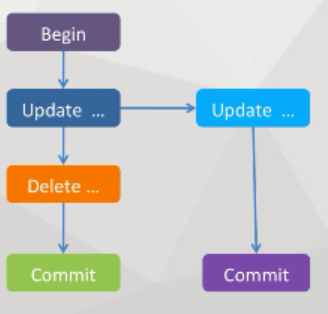
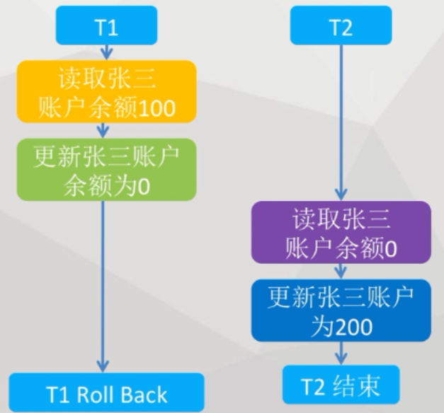
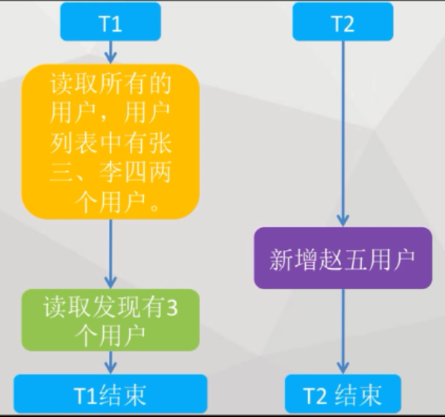
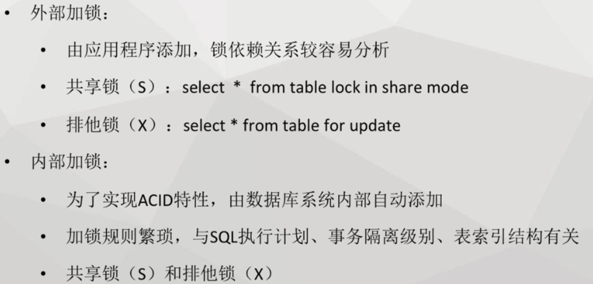

# 事务  

_本来一件事情执行a,b,c就结束了，但是如果b出现停止，就会导致整个系统出错。事务就是把a,b,c捆绑在一起，一次执行，就算失败就全部失败，以此来保证数据的正确性。_

## 1.事务的四大特性   

#### 1.原子性（Atomicity）  

　　原子性是指事务包含的所有操作要么全部成功，要么全部失败回滚，这和前面两篇博客介绍事务的功能是一样的概念，因此事务的操作如果成功就必须要完全应用到数据库，如果操作失败则不能对数据库有任何影响。  

_转账过程中，a出钱，b入钱是属于一个不可分割的部分_  

#### 2.一致性（Consistency）  

　　一致性是指事务必须使数据库从一个一致性状态变换到另一个一致性状态，也就是说一个事务执行之前和执行之后都必须处于一致性状态。

　　拿转账来说，假设用户A和用户B两者的钱加起来一共是5000，那么不管A和B之间如何转账，转几次账，事务结束后两个用户的钱相加起来应该还得是5000，这就是事务的一致性。

_转账后钱的总数是不会变的_

#### 3.隔离性（Isolation）  

　　隔离性是当多个用户并发访问数据库时，比如操作同一张表时，数据库为每一个用户开启的事务，不能被其他事务的操作所干扰，多个并发事务之间要相互隔离。

　　即要达到这么一种效果：对于任意两个并发的事务T1和T2，在事务T1看来，T2要么在T1开始之前就已经结束，要么在T1结束之后才开始，这样每个事务都感觉不到有其他事务在并发地执行。

　　关于事务的隔离性数据库提供了多种隔离级别，稍后会介绍到。

_甲转钱给乙，丙转钱给甲，这两次操作都不应该影响彼此_

#### 4.持久性（Durability）  

　　持久性是指一个事务一旦被提交了，那么对数据库中的数据的改变就是永久性的，即便是在数据库系统遇到故障的情况下也不会丢失提交事务的操作。

　　例如我们在使用JDBC操作数据库时，在提交事务方法后，提示用户事务操作完成，当我们程序执行完成直到看到提示后，就可以认定事务以及正确提交，即使这时候数据库出现了问题，也必须要将我们的事务完全执行完成，否则就会造成我们看到提示事务处理完毕，但是数据库因为故障而没有执行事务的重大错误。   

_就算地震了，甲乙丙的钱该转的也转了，该留的还是留着_  

## 2.事务控制步骤   

1. 默认情况下为非事务模式，开启方式为：.setAutoCommit(false)      
2. 提交事务：.commit()   

_只要提交，才执行前面的sql语句_

3. 当事务过程发生问题，则需要执行回滚方法,以保证原子性：.rollback()     

_在出错的时候让sql语句不执行_   

## 3.代码示例   

```java
			//建立数据连接
			conn=ds.getConnection();
			//1.开启事务处理
			conn.setAutoCommit(false);
//原子的开始
			PreparedStatement ptmt = conn.prepareStatement("update user set  password = ? where userName = ?");
			ptmt.setString(1, "0");
			ptmt.setString(2, "张三");      //设置参数
			ptmt.execute();        //执行了第一条
			ptmt.setString(1, "999");
			ptmt.setString(2, "李四");      //设置参数
			ptmt.execute();     
			conn.commit();    //2.提交事务
//原子的结束
		} catch (Exception e) {
			if(conn!=null){
				try {
					conn.rollback();     //3.捕捉异常回滚事务
				} catch (SQLException e1) {
					// TODO Auto-generated catch block
					e1.printStackTrace();
				}
			}
		}
```

1.开启事务处理  

2.提交事务  

3.捕捉异常回滚事务  

## 4.断点处理控制  

- 在update下面设置断点，当delete出现异常之后，就会回滚到update之后，而不是回滚全部的内容。但是这样就破坏了之前的原子性。所以需要在回滚之后做相应的操作。 
- 设置断点的方式：   ``sp=conn.setSavepoint();``   

  

_之前是甲转钱给乙，如果中途出现问题就转钱失败，钱还在甲那里。而断点处理则是甲转钱给乙，如果中途出现错误，钱转到银行库里先冻结住，这时候甲乙都没有钱。_  

- 代码示例  

```java
		try {
			//建立数据连接
			conn=ds.getConnection();
			//开启事务处理
			conn.setAutoCommit(false);
			//设置prepareStatement带占位符的sql语句
			ptmt = conn.prepareStatement("update user set  password = ? where userName = ?");
			ptmt.setString(1, "0");
			ptmt.setString(2, "张三");      //设置参数
			ptmt.execute();     
			//1.设置断点 
			conn.setSavepoint();
			ptmt.setString(1, "999");
			ptmt.setString(2, "李四");      //设置参数
			throw new Exception();
		} catch (Exception e) {
			if(conn!=null){
				try {
					conn.rollback();     //捕捉异常回滚事务
					ptmt.setString(1, "666");     //2.保证事务原子性的弥补操作
					ptmt.setString(2, "赵五");     
					ptmt.execute();
					conn.commit();
				} catch (SQLException e1) {
					// TODO Auto-generated catch block
					e1.printStackTrace();
				}
			}
		}
```

1.设置断点   

2.保证事务原子性的弥补操作  

## 5.事务的隔离级别  

### 1.事务的隔离级别  

#### 1.脏读 （A读未提交-允许出现）  

读取一个事务未提交的数据  

  

_A银行动作慢，B银行动作快。张三去A银行给李四转100，然后又去B银行存入了200。A银行告诉总部它准备把钱从张三账户拿出来，然后放入李四账号，但是还没真正实施。这时候B银行就问银行总部张三多少钱，总部说等一下就变成0元了，B银行就算上存入的200元，得出结果：张三账户余额为200元。然而不负责任的A银行发现李四的账户有问题，钱存不进去，于是就放弃了这次业务，当作张三没来过。所以张三就平白无故少了一百元。_     

#### 2.不可重复读（B读提交-允许出现）

同一个事务两次读取相同的事务结果不一样  

  

_张三去银行把余额打印出来，要求交两份，于是就点击打印两张。打印第一张的时候是余额100元。这个时候也很巧，张三老妈刚好给张三汇了200零用钱，导致张三打印出来第二张是300元，张三一脸懵逼。（在这个例子中好像问题不大，但是在编程中是一个比较大的缺陷。）_   

#### 3.幻读（C重复读-允许出现）【MySql默认】      

幻读不是数据上的差别，而是行记录的差别  

  

_用一天银行要记载两份一样的用户信息，查看用户的时候，第一次看到只有张三李四两个用户，于是记了下来。回头又看了一次，刚好这回又多了赵五这个用户，银行不知道记第二份。最后由于两份资料不同被领导痛骂了一顿。_

#### D串行化

所有的事务都是串行执行的，但会导致性能很差。

_事情一件一件来，不允许并发进行_  

- 设置隔离级别的方法：setTransactionlsolation()     

## 6.死锁   

- 两个以上的事务在执行过程中，因争夺资源相互等待的现象。   

  

_塞车也是同个原理，你我都想走先走，从而互不相让被堵死，这个时候就需要交警进行外部干涉。_

- 解决死锁：按序获取锁资源  

## 7.加锁方式  

  

（死锁的具体介绍，解决方式日后补上）

