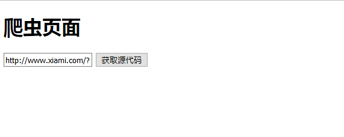
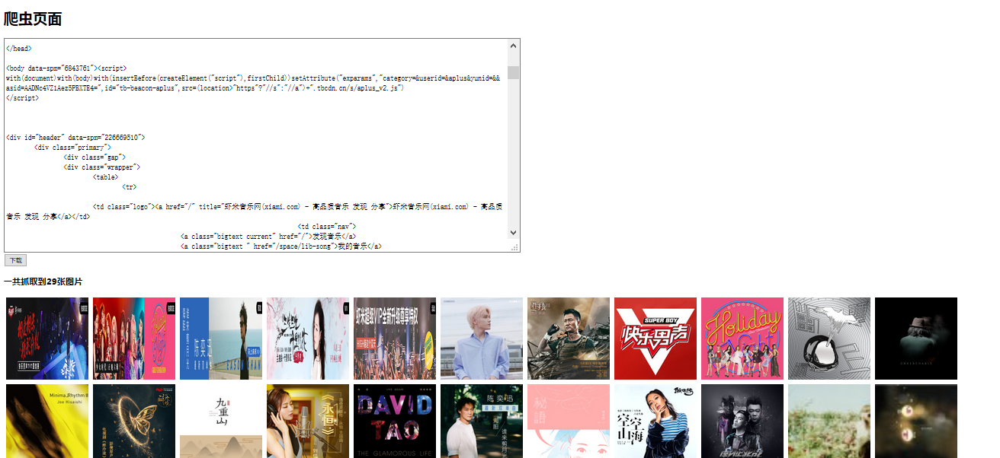

# Java实现简单爬虫  

### 1.后台页面的编写

```java
public class TmDownImgUtil {
	/**
	 * 依据网址获取网站源码
	 * @param link
	 * @param encoding
	 * @return
	 */
	public static String htmlSource(String link,String encoding){
		StringBuilder stringBuilder=new StringBuilder();
		try {
			URL url =new URL(link);   //获取网络对象
			URLConnection uc=url.openConnection();   //建立网络链接  
			uc.setRequestProperty("User-Agent", "java");   //伪装
			InputStream inputStream=uc.getInputStream();  //获取文件输入流
			InputStreamReader in=new InputStreamReader(inputStream,encoding); //建立io流缓冲
			BufferedReader reader=new BufferedReader(in);   //下载代码缓冲区
			
			//开始下载源码
			//创建一个临时文件 
			String line=null;
			//循环
			while((line=reader.readLine())!=null){
				stringBuilder.append(line+"\r\n");
			}
			
			//关闭
			reader.close();
			in.close();
			
		} catch (Exception e) {

			e.printStackTrace();
		}
		
		
		return stringBuilder.toString();
	}
	
}
```

获取到编码还有地址之后，打开网络连接，获取页面之后将其存入String中返回  

###  2.index.jsp页面的编写

```html
<%@ page language="java" contentType="text/html; charset=utf-8"
    pageEncoding="utf-8"%>
<!DOCTYPE html PUBLIC "-//W3C//DTD HTML 4.01 Transitional//EN" "http://www.w3.org/TR/html4/loose.dtd">
<html>
<head>
<meta http-equiv="Content-Type" content="text/html; charset=utf-8">
<title>java爬虫抓图</title>
<script type="text/javascript">
	function validator() {
		//判断网址合法性
		//获取输入框的值
		var url=document.getElementById("url").value;
		//判断不是为空或者长度为0
		if(url=""||url.length==0){
			alert("请输入url");
			document.getElementById("url").focus();   //获取焦点
			return false;
		}
		if(url!=""&&url.indexOf("http://")==-1){
			alert("请输入正确的url");
			document.getElementById("url").focus();   //获取焦点
			return false;
			
		}
		
	}

</script>
</head>
<body>
	<div class="box">
		<h1>爬虫页面</h1>
		<form action="source.jsp" method="post" onsubmit="return validator();">
			<input type="text" placeholder="请输入URL：如http://www.qq.com" name="url" id="url">
			<input type="submit" value="获取源代码"/> 
		</form>
	</div>


</body>
</html>
```

获取页面链接，调用js代码对输入框进行筛选，然后用表格的方式提交到另外一个页面中  

### 3.source.jsp页面的编写  

```html
<%@page import="com.kcat.TmDownImgUtil"%>
<%@ page language="java" contentType="text/html; charset=utf-8"
    pageEncoding="utf-8"%>
<!DOCTYPE html PUBLIC "-//W3C//DTD HTML 4.01 Transitional//EN" "http://www.w3.org/TR/html4/loose.dtd">
<html>
<head>
<meta http-equiv="Content-Type" content="text/html; charset=utf-8">
<script type="text/javascript" src="jQuery/jquery-1.11.3.js"></script>
<title>Insert title here</title>
<%
//获取url
	String url=request.getParameter("url");
//获取源代码
	String html=TmDownImgUtil.htmlSource(url, "utf-8");
//将源代码输出到页面对象中
	pageContext.setAttribute("htmlsource", html);

%>

</head>
<body>
	<div class="box">
		<h1>爬虫页面</h1>
		<textarea style="width: 1120px; height: 460px; overflow: auto;" id="source">${htmlsource}</textarea>
	</div>
	<form action="download.jsp" method="post">
		<input type="submit" value="下载"/> 
	</form>
	<h3>一共抓取到<span id="count"></span>张图片</h3>
	<script type="text/javascript">
		//解析源代码获取图片素材
		var source=$("#source").val();
		//jq 对象
		var $source=$(source);
		//计数
		var i=0;
		//遍历所有img图片
		$source.find("img").each(function(){
			var src=$(this).attr("src");
			if(src!=""&&src.length>0&&src.indexOf(".jpg")!=1){
				$("body").append("<div style='float:left; margin:5px;'></div>");
				i++;
			}
			$("#count").text(i);
		});
	</script>

</body>
</html>
```

1. 调用后台，将获取到的页面地址传到后台，返回后台传来的html代码   

（后台调用可以直接使用类名使用：``String html=TmDownImgUtil.htmlSource(url, "utf-8");``）   

2. 将调用到的信息存进page中，通过EL表达式提取出来``${htmlsource}``  
3. 使用jq代码，对页面内容进行判断（打包成jq对象）：img标签的么？src是.jpg结尾吗？是的话就将其标签添加到body中  

（jq代码写在html中不用调用也能执行）  


页面效果：

  

  


[案例源码](../SourceCode/Crawler/)    